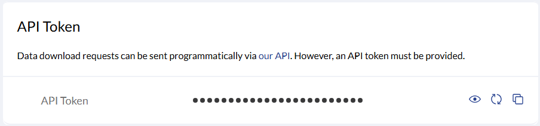

# Trabajar con datos de radiosondeos con Python

Este repositorio contiene dos ficheros de Python, un script para descargar sondeos con datos de reanálisis de ERA5 y un Jupyter Notebook que nos permite descargar datos de radiosondeos de estaciones de medida y representarlos

## Requisitos

- Python 3.x
- `numpy`, `pandas` and `sounderpy`
- [CDS API](https://cds.climate.copernicus.eu/api-how-to)

Instala dependencias con:

```bash
pip install numpy pandas sounderpy cdsapi
```
# Descarga Sondeos ERA5: downloadSounding.py

Este script en Python permite descargar perfiles atmosféricos de altura, presión y temperatura a partir de los datos de reanálisis ERA5, proporcionando latitud, longitud y fecha como entrada, y guardarlos en formato .csv. Utiliza las funcionalidades de SoundePy (https://github.com/kylejgillett/sounderpy), desarrollado por Kyle J. Gillett, y está pensado para su uso en análisis de señal LIDAR, por lo que dispone de una opción para determinar la resolución vertical. Con el objetivo de analizar señales LIDAR en Sudamérica, se buscó crear un software simple y rápido que permitiera descargar datos de reanálisis lo más próximos posible, tanto espacial como temporalmente, a las medidas, sin depender de datos observacionales. Se utilizan datos de ERA5 (ECMWF), que proporciona información a nivel global con resolución 0.25°. Uno de los principales problemas encontrados fue que otros modelos, como los de NCEP, RAP, etc., solo funcionan en Norteamérica y/o Europa.

## Tabla de Contenidos

- [Instalación](#Instalación)
- [CDSAPI](#)
- [Uso](#uso)
- [Contribuciones](#contribuciones)
- [Licencia](#licencia)

## Instalación

Para utilizar el script solo necesitamos disponer de Python y configurar el CDS API.

### Configuración del acceso a Copernicus (CDS API)

Para poder descargar datos de ERA5 necesitas configurar el acceso al Climate Data Store (CDS) de Copernicus.

1. Crear una cuenta

Regístrate (si no lo has hecho) en:  
[https://cds.climate.copernicus.eu/](https://cds.climate.copernicus.eu/)


2. Obtener tu clave API

Una vez dentro:

- Accede a tu perfil: [https://cds.climate.copernicus.eu/profile](https://cds.climate.copernicus.eu/profile)
- Copia la línea que aparece en la sección **"API Token"**, por ejemplo:



3. Crear el archivo `.cdsapirc` con la API Token y la url como se indica a continuacion:

```bash
url: https://cds.climate.copernicus.eu/api/
key: TU-UID:TU-API-KEY
```

Guarda esa línea en un archivo de texto llamado `.cdsapirc` en tu directorio personal:

Linux:
```bash
~/.cdsapirc
```
Windows
```bash
C:\Users\Username\.cdsapirc
```

## Uso

Puede ejecutarse con argumentos o sin ellos (especificandolos dentro del programa)

```bash
python dowloadSounding.py    latitude   longitude   resolution   date     hour    download_folder
```
	      (0)    		(1)        (2)         (3)  	  (4)      (5)         (6)
**Configuration:**  
latitude  # ie. 40.0   # Specify the latitude of the site/station  
longitude  # ie. -3.7  # Specify the longitude of the site/station  
resolution  # ie. 3.75  # Specify the resolution in meters (3.75m is the default LIDAR resolution)  
\-Note: If negative, no resampling is done (250m resolution)  
date  # ie. "2024-07-15"  # Specify the date in 'YYYY-MM-DD' format  
hour  # ie. "12"  # Specify the hour in 'HH' format  
download_folder  # ie. "Granada_Soundings"  # Specify the folder to save downloaded data  
\-Note: Create it if it does not exist in current working directory (cwd)  

Example: 

```bash
python downloadSounding.py 40.0 -3.7 3.75 2024-07-15 12 Granada_Soundings
```
Using hardcoded values:

```bash
python downloadSounding.py 
```

# Análisis de Radiosondeos: analisis_sondeo.ipynb