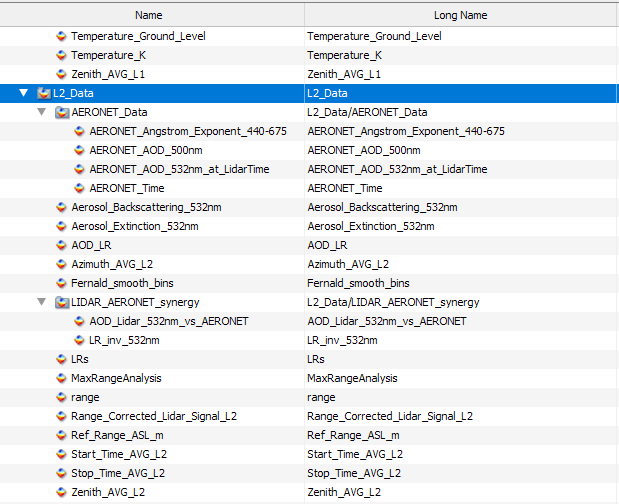
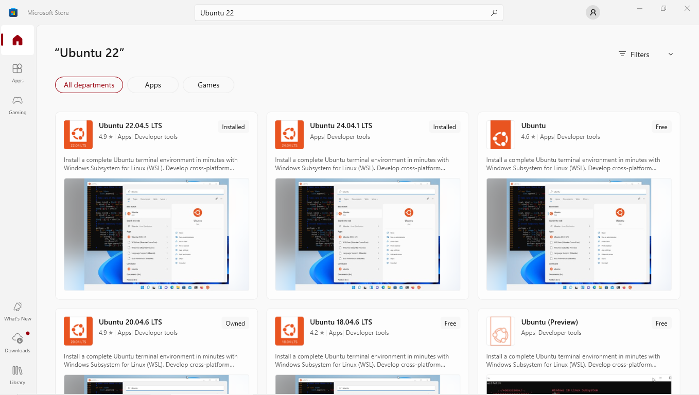
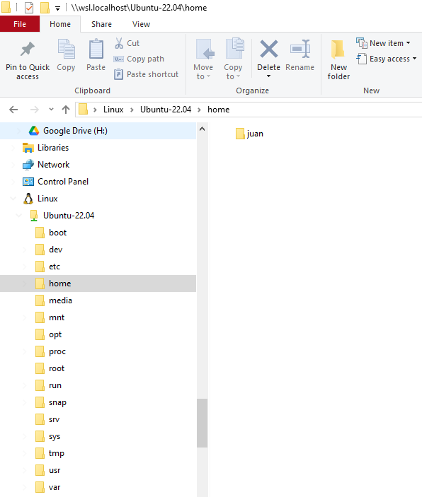
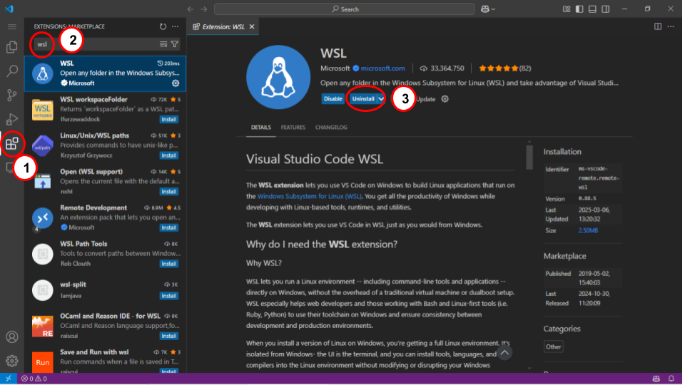
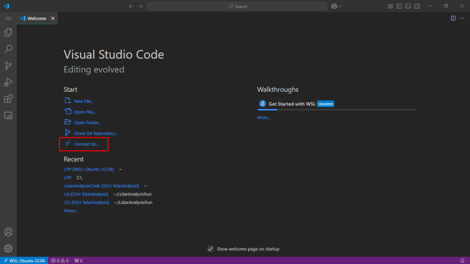
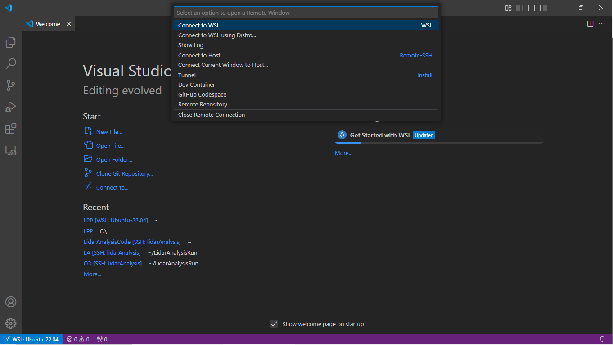
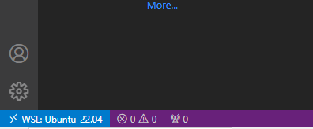
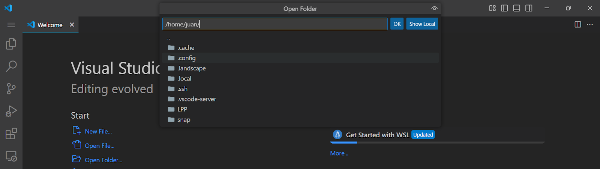

# Table of content: <!-- omit in toc -->

- [Credits \& contributions](#credits--contributions)
- [Introduction](#introduction)
- [Overall concept of the LPP tools](#overall-concept-of-the-lpp-tools)
  - [Runing a LPP module](#runing-a-lpp-module)
- [Installation](#installation)
- [Setting up the code](#setting-up-the-code)
  - [Installing dependencies](#installing-dependencies)
  - [Building the code](#building-the-code)
  - [Configuring and running LPP modules](#configuring-and-running-lpp-modules)
- [Product Data Level 0 Module: Converting raw lidar files in a single NetCDF file](#product-data-level-0-module-converting-raw-lidar-files-in-a-single-netcdf-file)
- [Product Data Level 1 Module: Lidar signals corrections and layer-mask](#product-data-level-1-module-lidar-signals-corrections-and-layer-mask)
- [Product Data Level 2 Module: Aerosol optical products](#product-data-level-2-module-aerosol-optical-products)
    - [AERONET data](#aeronet-data)
      - [Providing the AERONET data manually](#providing-the-aeronet-data-manually)
      - [Downloading AERONET data automatically](#downloading-aeronet-data-automatically)
    - [Lidar-AERONET synergy](#lidar-aeronet-synergy)
- [Automatizing LPP](#automatizing-lpp)
- [LALINET NetCDF File Format](#lalinet-netcdf-file-format)
  - [NetCDF's File Produced for Data Level 0](#netcdfs-file-produced-for-data-level-0)
    - [Dimensions](#dimensions)
    - [Variables](#variables)
    - [Global attributes](#global-attributes)
  - [NetCDF's File Produced for Data Level 1](#netcdfs-file-produced-for-data-level-1)
    - [Dimensions](#dimensions-1)
    - [Variables](#variables-1)
    - [Group Attributes](#group-attributes)
  - [NetCDF's File Produced for Data Level 2](#netcdfs-file-produced-for-data-level-2)
    - [Dimensions](#dimensions-2)
    - [Variables](#variables-2)
    - [Group Attributes](#group-attributes-1)
- [Using LPP in Windows 10/11 OS:](#using-lpp-in-windows-1011-os)
  - [Step 1: Install Windows Subsystem for Linux (WSL)](#step-1-install-windows-subsystem-for-linux-wsl)
  - [Step 2: Install Visual Studio Code](#step-2-install-visual-studio-code)
    - [On Windows](#on-windows)
  - [On Linux](#on-linux)
    - [For Debian/Ubuntu-based systems:](#for-debianubuntu-based-systems)
    - [For Red Hat/Fedora-based systems:](#for-red-hatfedora-based-systems)
    - [Manual Installation](#manual-installation)
    - [On macOS](#on-macos)
  - [Step 3: Install WSL extension in Visual Studio Code](#step-3-install-wsl-extension-in-visual-studio-code)

# Credits & contributions
<u>**Juan Pallotta:**</u> Software development, methods, and algorithms.  
<u>**Henrique Barbosa:**</u> Methods, algorithms and research supervisor. Dataset used for the testing.  
<u>**Nicolas Neves de Oliveira:**</u> Software development for automatic AERONET downloader. LPP tester.  
<u>**Fabio Lopez:**</u> Methods, algorithms. Dataset used for the testing.     
<u>**Silvania Alves De Carvalho:**</u> LPP tester. Comparison of LPP results against other platforms.  
<u>**Diego Arias:**</u> Methods and algorithms.   
<u>**Alexandre Cacheffo and Eduardo Landulfo:**</u> reviewed and edited the research paper of the project.  

# Introduction

The LPP is a collection of tools developed in C/C++ and Linux script, planned to handle all the steps of lidar analysis. In the present version of LPP, only elastic lidar signals are analyzed, but it is planned to manage depolarization and Raman signals in the future.
LPP is comprised of 3 main modules: `lpp0`, `lpp1`, and `lpp2`, each one producing a different data level. The first module converts the raw lidar data files into a single NetCDF file, including detailed information about the instrument and acquisition setup (product data level 0 or PDL0). The produced NetCDF files are then processed by the next module which applies the necessary corrections to the raw lidar signals and computes the layer-mask (product data level 1 or PDL1). The final step is the elastic retrieval of aerosol parameters (product data level 2 or PDL2), and for this first release of LPP, only elastic lidar signals are processed.
The development of LPP is based on the existing analysis routines developed by individual LALINET groups and hence takes advantage of previous efforts for algorithm comparison within the scope of the LALINET network. The code presented in this repository was tested on Linux Ubuntu 22.04.5 LTS and GCC 11.4.0.

# Overall concept of the LPP tools

The Lidar Processing Pipeline (LPP) is formed by 3 completely independent software (or modules), which communicate with each other using NetCDF files. The names of each one are represented by the output of its product data level (PDL), named from 0 to 2. Each one of these modules can be executed in a Linux command line following the basic rules described in this document. These modules are:

* `lpp0`: Transforms all the raw lidar data files stored in a folder (passed as an argument) into a single NetCDF file. This output NetCDF file will contain the raw lidar signals and global information about the measurement. This output is the L0 data level of LPP.
* `lpp1`: Receive the NetCDF file produced by `lpp0` and produce a new NetCDF defined as data level 1 (L1). This L1 file contains the same information as the data level L0 and adds L1 products. These new data include corrected lidar files (like laser offset, bias correction, etc.), the layer-mask, temperature and pressure profiles. Also, all the parameters used to produce this output are stored. This output is called the L1 data level of LPP.
* `lpp2`: Receive the NetCDF file produced by `lpp1` and produce a new NetCDF file defined as data level 2 (L2). This L2 file contains the same data as L0 and L1, adding the optical retrieval from one selected elastic channel. Also, all the parameters used to produce this output are stored. This output is the L2 data level of LPP.

It is important to remark that the output files produced in stages 1 and 2 contain all the information of the previous stage. The new file generated in each module adds the new information of the stage under analysis in a NetCDF's sub-group called **L*x*_Data**, being **x** as the data level number.

In the next figure, an output file is inspected with the software Panoply (<https://www.giss.nasa.gov/tools/panoply/>), where the data added in the stages L1 and L2 can be seen in their corresponding groups, while the L0 data is stored in the root of the NetCDF file.

<!--   -->
 

If the **L*x*_Data** is expanded, we can see their variables:

 

The description of each variables and its dimensions are described later in this document (section [LALINET Data Type Format](#lalinet-netcdf-file-format)).

## Runing a LPP module

Each LPP module must be run in a Linux terminal, following the convention:

<a name="run_module"></a>

```
$./lidarAnalysis_PDLx /Input_File_or_Folder/ /Output_File analysisParameters.conf
```

Where:

* `lidarAnalysis_PDLx`: Software module to generate the data level ***x***.
* `/Input_File_or_Folder/`: Input folder or file to produce the data Level ***x***. In the case of L0, this first parameter is the folder with the raw lidar data files in Licel data file format. For the rest of the data levels, the input is the NetCDF file produced in the previous stage.
* `/Output_File`: Output NetCDF filename. The output file contains the information of the input folder/file, adding the information of the new data of the level under analysis.
* `analysisParameters.conf`: Configuration file with all the variables needed for the level analysis.

<!-- - `[Extra_Files]`: Not mandatory information containing extra data about the lidar system, like background noise or overlap function. -->

To avoid possible errors, and to establish a standardization, use <u>**absolute paths**</u> for all the file's arguments passed to each module (`/Output_File` and `/Input_File_or_Folder/`).

In the next sections, a step-by-step on how to download/clone, build and run LPP's modules are described.

# Installation

The installation of the LPP software and its dependencies is very straightforward, and shouldn't be a problem. If some problem arises, do not hesitate to drop an email to [juanpallotta@gmail.com](mailto:juanpallotta@gmail.com).

Start by downloading the repository from GitHub <https://www.github.com/juanpallotta/LPP>. Uncompress the ZIP file in the most convenient location of your hard disk, where you will find:

* `/libLidar`: Folder with C/C++ lidar libraries source code.
* `/Lidar_Analysis_PDL0`: Folder with C/C++ sources code of the module `lpp0` for producing data level 0.
* `/Lidar_Analysis_PDL1`: Folder with C/C++ sources code of the module `lpp1` for producing data level 1.
* `/Lidar_Analysis_PDL2`: Folder with C/C++ sources code of the module `lpp2` for producing data level 2.
* `/Lidar_Configuration_Files`: Folder containing the configuration files (`.conf`) for each module. Also, the settings file for an automatic run (see later [section](#automatizing-lpp) about the LPP automation).
* `/signalsTest`: Lidar test files to test this code. You will find files from Buenos Aires, Argentina (Licel data type files) and Brazil: Sao Paulo (folder `Brazil/SPU/`) and Manaus (folder `Brazil/Manaus`).
* \`install_Lidar_Dependencies.sh: Linux shell script to install the basic software/libraries needed to use LPP.
* `/compileAll.sh`: Linux shell script to compile all the modules. Used with the parameter `clean`, all the compiled object files will be removed.
* `/run_LPP_Analysis.sh`: Linux shell script to run the whole chain automatically. The main settings for an automatic run are configured in the setting file `/Lidar_Configuration_Files/LPP_Run_Settings.sh`. More about the automatization of all modules in [Automatizing LPP](#automatizing-lpp) section of this README file.
* `README.md`: This file.

# Setting up the code

The first steps after downloading/cloning the LPP's source code are described in this section. After these steps, LPP will be ready to be used.

## Installing dependencies

There are a few prerequisites to be installed prior to building LPP. This job can be done by running the Linux shell script named `install_Lidar_Dependencies.sh`. It is a simple Linux shell script to install the basic packages (make, g++, and NetCDF libraries). You will be asked for administrator credentials. Remember to set `install_Lidar_Dependencies.sh` with executable attributes: `chmod +x install_Lidar_Dependencies.sh`.

## Building the code

To compile all the modules, just run the Linux shell script named `compile_All.sh`. This is a simple Linux script that produces the executables of each module inside their folders. Remember to set `compile_All.sh` with executable attributes before running it: `chmod +x compile_All.sh`.
For a clean build, the parameter `clean` can be passed as an argument to the script in this way: `compileAll.sh clean`. This will remove the previous pre-compiled objects. So, the steps for a clean compilation is:  
1°: Execute `./compileAll.sh clean`  
2°: Execute `compileAll.sh`  
After that, a new set of executables files will be available.
At the moment, the compiler output may show some warnings during the compiling time. All of them will be solved in future versions.

## Configuring and running LPP modules

The behavior of each module is based on the parameters written in its configuration file, passed as the [third argument](#runing-a-lpp-module). They are stored in the `/Lidar_Configuration_Files/` folder of this repository. These are text-based files and contain the variables needed for running the module. Its syntactic is very straightforward, having to follow only 4 main rules:


1. Comments are defined by "`#`" character. You are free to comment on anything to make the run more understandable for you. The configuration files included in this repository have many comments to explain each variable. <u>**IMPORTANT NOTE: Do not place a comment in the same line of the variable definition after the variable. Comments must be in separate lines of the variables.</u>**
2. Variables definition must follow the convention typo `VAR_NAME = VALUE`, and a <u>**minimum of 1 space character has to be placed before and after the "**`=`" character</u>. The variable's data type can be integer, float, double, or string, depending on the variable.
3. Some variables have to be set as vectors. Each element must be separated by a comma character "`,`", for instance: `VAR_NAME = VALUE1 , VALUE2 , VALUE3`, <u>**and a minimum of 1 space has to be placed before and after the comma "**`,`"</u>. The number of elements depends on the variable, and how LPP makes use of it. To minimize the mistakes related to this, please, read the comments in the lines before the variable definition. In case the number of elements doesn't meet the right values, LPP will show a warning and the execution will be stopped.
4. The configuration file <u>**must**</u> be the same for all the modules, containing all the variables needed for the run. All these variables are described in this document.

It is worth mentioning that there is no rule for the order of the variables set in this file. The next piece of code shows the general parameters contained in the configuration files:

```bash
##########################################################################################
# GENERAL PARAMETERS
##########################################################################################

# INITIAL RANGE OF ANALYSIS: rInitSig
rInitSig = 800
```

Where:

<!-- - `maxZthAngle`: Maximum zenithal angle (in degrees) to be used in the analysis. -->

* `rInitSig`: Initial range of the analysis (in meters from the lidar line of sight). It is preferable to set this value to the first point where the full overlap is achieved.

The following sections describe each module and the variables that must be configured for a correct run. We highly encourage you to run the examples shown and play with its variables to feel comfortable with the uses of the modules.

# Product Data Level 0 Module: Converting raw lidar files in a single NetCDF file

This module is used to merge the raw lidar files located in a folder (passed as first argument), into a single NetCDF file (path and filename passed as a second argument). The configuration file is passed as the third argument, and it's going to be described in this section.

An example of how to run this module using the sample signals included in this repository is shown below:

```
./lpp0 /mnt/Disk-1_8TB/Brazil/SPU/20210730/ /mnt/Disk-1_8TB/Brazil/SPU/20210730/LPP_OUT/20210730_L0.nc /home/LidarAnalysisCode/LPP/Lidar_Configuration_Files/analysisParameters_Brazil.conf
```

Where:

* Executable file `lpp0`: Executable file of the L0 module.
* <u>Absolut input path to the Licel files</u> `/mnt/Disk-1_8TB/Brazil/SPU/20210730/`: Absolute input folder path with the raw-lidar files in the Licel data format. Since Licel files have no defined extension, <u>**it is critical that nothing but raw lidar data files must be in this input folder**</u>.
* <u>Absolut path to save the output NetCDF file</u> `/mnt/Disk-1_8TB/Brazil/SPU/20210730/LPP_OUT/20210730_L0.nc`: Absolute output path, <u>**including the file name**</u> of the output NetCDF file, in this example `20210730_L0.nc`. If the output file path contains subfolders, it will be generated automatically (in this example `/LPP_OUT/`).
* <u>Absolut path to the configuration file</u> `/home/LidarAnalysisCode/LPP/Lidar_Configuration_Files/analysisParameters_Brazil.conf`: Absolute path to the configuration file containing the variables needed for the merging.

<!-- - `[Background_Noise_File]`: This fourth argument is optional and is the absolute path to the background noise file. This file is obtained by performing a regular measurement with the telescope fully covered. If this file is provided, the data will be added to the NetCDF file under the variable `Bkg_Noise`. If this file is not provided, a "-" character must be used as the fourth argument.

* `[Overlap_File]`: This fifth argument is optional and is the absolute path to the overlap file. This file must be a text comma-separated file (.cvs), having one overlap file for each channel. The first line must contain the labels of each column, and the first column must contain the range array with the same resolution as the lidar signals. <u>**Important Note:</u> No extra line/s must be contained** at the end of the file.
  In the following lines, an example of the first row and column with its overlap values are shown: -->

For this data level, the parameters needed are described bellow:

```bash
##########################################################################################
# PARAMETERS FOR lpp0
##########################################################################################

# DATE-TIME RANGE TO ANALYZE INSIDE THE FOLDER PASSED AS ARGUMENT TO lpp0
# IF minTime = maxTime --> ALL FILES INSIDE THE FOLDER
minTime = 2022/03/02-01:00:00
maxTime = 2022/03/02-02:00:00

# UTC REFERENCE
Time_Zone = 0.0

# INPUT DATAFILE FORMAT
inputDataFileFormat = LICEL_FILE

# OUTPUT NETCDF DATAFILE FORMAT --> outDataFileFormat
outputDataFileFormat = LALINET_NETCDF
```

Where:

* `minTime` and `maxTime`: Minimum and maximum time to analyze inside the folder passed as the first argument. The format must be like the example shown above **YYYY/MM/DD-HH:MM:SS**. If `minTime` and `maxTime` are equal, all the files inside the folder passed as arguments will be analyzed.
* `Time_Zone`: Difference hours referenced to UTC. If the time in lidar files is in UTC time, this variable must be set to zero. If the time of the files is set in local time, and for instance, the lidar is from Argentina, it must be set -3.
* `inputDataFileFormat`: At the moment, only Licel (`LICEL_FILE` option) data type files are accepted. There is planned to accept more input data types formats in the future. Take into account that for Raymetric lidars, the data file format used is Licel files, so this variable must be set as `LICEL_FILE` for these systems.
* `outputDataFileFormat`: The output data types accepted are: LALINET (`LALINET_NETCDF`) and Single Calculus Chain (`SCC_NETCDF`) data type files. If `SCC_NETCDF` is selected, higher modules of LPP (`lpp1` and `lpp2`) can not be executed due to the different naming conventions of the variables inside the file. A detailed description of the LALINET data type can be seen in later sections of this document ([LALINET data type format](#lalinet-netcdf-file-format)).

<!-- If `SCC_NETCDF` is selected, the output file generated can be used as input for the SCC platform (https://www.earlinet.org/index.php?id=281). More info about SCC data file format and its name convention is described on the web page of the project (https://docs.scc.imaa.cnr.it/en/latest/file_formats/netcdf_file.html).
To proceed most safely, we highly recommend uncommenting the proper line in the configuration files included in this repository. Also, it is worth mentioning that this input allows only one valid entry for each variable, so check carefully if only one line of each variable is enabled (uncommented). -->

# Product Data Level 1 Module: Lidar signals corrections and layer-mask

This module receives the NetCDF file produced by the previous module (`lpp0`) as its first parameter (in our example, `/mnt/Disk-1_8TB/Brazil/SPU/20210730/LPP_OUT/20210730_L0.nc`). This module will accept the input file while it is in the LALINET NetCDF format; this means, the variable `outputDataFileFormat = LALINET_NETCDF` should be set in the L0's module configuration file (`analysisParameters_PDL0_Brazil.conf` in this example).

An example of how to run this module can be:

```
./lpp1 /mnt/Disk-1_8TB/Brazil/SPU/20210730/LPP_OUT/20210730_L0.nc /mnt/Disk-1_8TB/Brazil/SPU/20210730/LPP_OUT/20210730_L0_L1.nc /home/LidarAnalysisCode/LPP/Lidar_Configuration_Files/analysisParameters_Brazil.conf
```

The configuration file (in this case, `/home/LidarAnalysisCode/LPP/Lidar_Configuration_Files/analysisParameters_Brazil.conf`) could be the same file used in module L0, or use another one. The only thing that matters is the defined variables inside the file passed as a third argument.

The sample files included in this repository use one configuration file for all the modules (in the examples shown in this documentation, this file is named `analysisParameters_Brazil.conf`).

An example of the settings variables for data level 1 contained in a configuration file are:

```bash

##########################################################################################
# PARAMETERS FOR lpp1
##########################################################################################

# DESATURATION
PHO_MAX_COUNT_MHz = 250

# GLUING INFORMATION
# IF NO GLUING SIGNALS IS NEEDED, THE LINES CONTAINING THE VARIABLES indx_Gluing_Low_AN AND indx_Gluing_High_PHO MUST BE COMMENTED
MIN_TOGGLE_RATE_MHZ = 0.5
MAX_TOGGLE_RATE_MHZ = 10
indx_Gluing_Low_AN   = 2
indx_Gluing_High_PHO = 3

# DEPOLARIZATION CONFIGURATION
# THE FINAL SIGNAL WILL BE CONFORMED AS: TOT = indx_Ch_Pol_P + Pol_Cal_Constant * indx_Ch_Pol_S
indx_Ch_Pol_P = 6
indx_Ch_Pol_S = 8
Pol_Cal_Constant = 1.325

# NOISE FILE OBTAINED WITH THE TELESCOPE COVERED AND THE LASER FIRING.
# ! IF THERE IS NO NOISE FILE: PATH_DARK_FILE MUST BE SET AS: "-"
PATH_DARK_FILES = /mnt/Disk-1_8TB/Brazil/SPU/2017_09_28_dt/dark_current/

# OVERLAP FILE.
# ! IF THERE IS NO OVERLAP FILE: VERLAP_FILE MUST BE SET AS: "-"
# ! IF THERE IS    OVERLAP FILE: OVERLAP_FILE MUST BE SET WITH THE FULL PATH
OVERLAP_FILE = /mnt/Disk-1_8TB/Brazil/SPU/Overlap_Files/overlap_SPU.csv

# LASER-BIN-OFFSET (OR TRIGGER-DELAY OR ZERO-BIN)
# ARRAY: ONE PER CHANNEL
indxOffset = 2 , 3 , 7 , 5 , 8 , 2 , 9 , 2 , 2 , 2 , 2 , 2 

# BACKGROUND CORRECTION METHOD = AUTO/FIT/MEAN/PRE_TRIGGER/NO_BKG
BkgCorrMethod = AUTO
# NUMBER OF BINS USED FOR BACKGROUND CALCULATION (TAKEN FROM THE TAIL OF THE LIDAR SIGNAL)
nBinsBkg = 1000

# NUMBER OF FILES (EVENTS) THAT WILL BE AVERAGED INTO A SINGLE LIDAR SIGNAL
numEventsToAvg_PDL1 = 10

# WAVELENGHT USED FOR PRODUCT DATA LEVEL 1 (PDL1). INDEXES STARTING FROM 0
# SP
indxWL_PDL1 = 2

# MOLECULAR DATA
# ABSOLUTE PATH TO THE RADIOSOUNDING/MODEL FILE. THIS FILE MUST BE FORMATTED:
# - COMMA SEPARATED
# - RANGE UNIT: METERS
# - TEMPERATURE UNIT: KELVIN
# - PRESSURE UNIT: PASCALS
Path_To_Molecular_File = ./US-StdA_DB_m_K_Pa.csv
# SETTINGS OF THE COLUMN INDEX (0-2) OF THE PARAMETERS: RANGE-TEMPERATURE-PRESSURE IN THE FILE:
Range_column_index_in_File = 0
Temp_column_index_in_File  = 1
Pres_column_index_in_File  = 2

Temperature_at_Lidar_Station_K = 298.15
Pressure_at_Lidar_Station_Pa = 94000.0

# LAYER-MASK RETRIEVAL PARAMETERS
COMPUTE_PBL_MASK = YES
COMPUTE_CLOUD_MASK = YES
avg_Points_Cloud_Mask = 11
stepScanCloud = 1
nScanMax = 5
errFactor = 2.0
thresholdFactor = 5.0
CLOUD_MIN_THICK = 5

errScanCheckFactor = 1.0
errCloudCheckFactor = 1.0
DELTA_RANGE_LIM_BINS = 10
```

Below is a description of each of these parameters:

* \`PHO_MAX_COUNT_MHz: Photon-counting maximum counting rate. Used for desaturation photon-counted lidar signals under a non-paralyzable method.
* `MIN_TOGGLE_RATE_MHZ` and `MAX_TOGGLE_RATE_MHZ`: Minumun and maximum rate of photon counting (in MHz) for the gluing procedure. See Licel manual for details (https://licel.com/manuals/analogpc.pdf).
* `indx_Gluing_Low_AN` and `indx_Gluing_High_PHO`: Indexes of the analog and photon-counting channels for gluing. It can be an array and must have the same number of elements, containing the indexes (starting at 0) of the channels to glue. For instance, if analog channel 2 should be glued to channel 3, the setting must be:

```
indx_Gluing_Low_AN   = 2
indx_Gluing_High_PHO = 3
```

in case of gluing more channels, it has to be added using a comma.

* `indx_Ch_Pol_P`, `indx_Ch_Pol_S` and `Pol_Cal_Constant`: Indexes of the parallel and cross polarized channels for total lidar signal generation. It can be an array and each variable must have the same number of elements, containing the indexes (starting at 0) of the channels. For instance, if analog channel 6 should be added to channel 8 thought the calibration constant `Pol_Cal_Constant`, the setting must be:

```
indx_Ch_Pol_P = 6
indx_Ch_Pol_S = 8
Pol_Cal_Constant = 1.325
```

The total lidar signals is then generated by performing **Tot = Sig_P(indx_Ch_Pol_P) + Pol_Cal_Constant * Sig_S(indx_Ch_Pol_S)**.


* `PATH_DARK_FILES`: Absolute path to the background files folder. These files must be obtained by performing a regular measurement with the telescope fully covered. LPP will average all the files included in this folder and produce a single profile for each channel by averaging all the files. If this file is provided, the data will be added to the NetCDF file under the variable `Bkg_Noise`. <u>**Important Note:</u> This information is not mandatory, and if is not provided, it must be commented on by writing** a `"`#"\` at the beginning of the line.


* `[Overlap_File]`: Absolute path to the overlap file. This file must be a text comma-sepparated file (.cvs), having one overlap profile for each channel. The first line must contain the labels of each columns, and the first column must contain the range array whith the same resolution of the lidar siganls. <u>**Important Note:</u> No extra line/s must contain at the end of the file.**
  In the followings lines, and example of the first row and column whith its overlap values are shown:

```bash
r,1064,1064,532,532,530,530,355,355,387,387,408,408
7.5,0.1039686755945483,0.1039686755945483,...
15,0.1131477684070227,0.1131477684070227,...
22.5,0.1335490472139786,0.1335490472139786,...
30,0.166872373584308,0.166872373584308,0.166872373584308,...
...
...
29992.5,1.00270381563113,1.00270381563113,1.00270381563113,...
30000,1.002703815715551,1.002703815715551,1.002703815715551,...
```

<u>**Important Note:</u> This information is not mandatory, and if is not provided, it must be commented with a** `"#"` at the beginning of the line.
It is highly recommended to use absolute paths to avoid errors in the execution.

* `indxOffset`: The number of bins to remove from the beginning of the lidar track recorded due to the laser offset. This parameter should be an array with one element for each channel acquired.
* `nBinsBkg`: Number of bins used for background correction. This quantity is taken from the tail of the lidar signal. From the example number in the previous line: the last 2000 bins will be used.
* `BkgCorrMethod`: Background method used for the background subtraction. There are 3 options:
  * `MEAN`: The bias of the lidar signal is obtained by computing the mean average of the last `nBinsBkg` bins.
  * `FIT`: The bias of the lidar signal is obtained by computing the linear fit of the pure molecular attenuated backscatter to the lidar signal across the last `nBinsBkg` bins. The independent term of the fit is taken as the bias of the lidar signal.
  * `AUTO`: An automated method to compute the bias of the raw lidar signal. This method is recommended in cases where molecular modulation is still detected at the end of the track recorded. This method is based on guessing a set of biases and a test algorithm to find which of the biases tested is the best.
  * `PRE_TRIGGER`: With this setting, the bias of the lidar signal is taked from the first `nBinsBkg` bins of the track recorded.
  * `NO_BKG`: No background is subtracted from the lidar signal.

* `numEventsToAvg_PDL1`: Time averaging for L1 data level products. This parameters tell to `lpp1` the numbers of the adjacents lidar profiles to average producing one merged profile. After this, the `time` dimension in the NetCDF file for the L1 data products will be reduced by `numEventsToAvg_PDL1` times. The averaging is applied to the L0 lidar profiles matrix.
* `indxWL_PDL1`: An index (starting from 0) of the channel to use in layer-mask production. It is recommended to use an elastic lidar channel and the highest wavelength in the file for better cloud discrimination.
* `Path_To_Molecular_File`: Path to the plain-text, comma-sepparated file containing the radiosonde/model data. This file must contain the altitude, temperature and pressure of the radiosonde/model used for the computation of the alpha and beta molecular profiles. The units of these variables are described in the comments of the setting file: altitude in meters (above sea level), temperature in Kelvin and pressure in Pascals. This repository has a sample file of US standard model (file `/LPP/Lidar_Analysis_PDL1/MolData/US-StdA_DB_m_K_Pa.csv`). The radiosonde/model file must be headerless, and the column order of each parameter (height, temperature and pressure) are described in the following variables (`Range_column_index_in_File`, `Temp_column_index_in_File` and `Pres_column_index_in_File`).
* `Range_column_index_in_File`: Column index of the radiosonde/model file containing the range values. For this example, index 0 (first column).
* `Temp_column_index_in_File`: Column index of the radiosonde/model file containing temperature values. For this example, index 1 (second column).
* `Pres_column_index_in_File`: Column index of the radiosonde/model file containing the pressure values. For this example, index 2 (third column).

The first lines of the `US-StdA_DB_m_K_Pa.csv` file contained in this repository are shown in the next lines (data contained in columns indexes 3 to 7 are not taken into account):

```
0,288.15,1013.27,0,0,1033.81,1.2247
200,286.85,989.48,0,0,1009.26,1.2013
400,285.55,966.13,0,0,985.22,1.1783
600,284.25,943.24,0,0,961.68,1.1557
800,282.95,920.78,0,0,938.62,1.1333
1000,281.65,898.77,0,0,916.05,1.1113
...
```

* `Temperature_at_Lidar_Station_K`: Temperature at ground level in Kelvins (K).
* `Pressure_at_Lidar_Station_Pa`: Pressure at ground level in Pascals (Pa)
* **LAYER-MASK RETRIEVAL PARAMETERS:** These parameters are required for the layer detection algorithm. We strongly recommend using the values set in the files included in this repository. The algorithm used is robust enough to work with a wide range of elastic-lidar signals using this setup.
  The first two variables are the ones recommended to be modified: `COMPUTE_PBL_MASK` and `COMPUTE_CLOUD_MASK`, which could be `YES` or `NO` depending if the planetary boundary layer (PBL) or cloud mask is needed to be detected.
  **<u>IMPORTANT NOTE:</u> PBL height determination is still under development, so the results may not be accurate, showing higher PBL heights than the real ones. It is recommended to set this parameter as** `NO`.

```bash
COMPUTE_PBL_MASK = NO
COMPUTE_CLOUD_MASK = YES
avg_Points_Cloud_Mask = 11
stepScanCloud = 1
nScanMax = 5
errFactor = 2.0
thresholdFactor = 5.0
CLOUD_MIN_THICK = 5
```

# Product Data Level 2 Module: Aerosol optical products

This module receives the NetCDF file produced by the previous module (`lpp1`) as a first parameter (in our example, `/mnt/Disk-1_8TB/Brazil/SPU/20210730/LPP_OUT/20210730_L0_L1.nc`). This module will accept the input file while it is in the LALINET NetCDF format; this means, the variable `outputDataFileFormat = LALINET_NETCDF` should be set in the configuration file of L0 module.

An example of how to run this module can be:

```
./lpp2 /mnt/Disk-1_8TB/Brazil/SPU/20210730/LPP_OUT/20210730_L0_L1.n /mnt/Disk-1_8TB/Brazil/SPU/20210730/LPP_OUT/20210730_L0_L1_L2.nc /home/LidarAnalysisCode/LPP/Lidar_Configuration_Files/analysisParameters_Brazil.conf
```

An example of the variables contained in the configuration file needed for data level 2 can be seen in the next code:

```bash

##########################################################################################
# PARAMETERS FOR lpp2
##########################################################################################

# NUMBER OF FILES (EVENTS) THAT WILL BE MERGED (AVERAGED) INTO A SINGLE LIDAR SIGNAL
# IF NEGATIVE, ALL THE L0 PRIFILES WILL BE AVERAGED
numEventsToAvg_PDL2 = 18

# NUMBER OF POINTS USED FOR A SLIDING WINDOWS SMOOTHING. APPLIED TO THE AEROSOL EXTINCTION AND BACKSCATTERING PROFILES. ONE NUMBER PER CHANNEL
avg_Points_Fernald = 5 , 5 , 5

# FERNALD INVERSION PARAMETER
# LR: COULD BE AN ARRAY OR A SINGLE VALUE
LR = 50 , 60 , 70 , 80

# INDEX OF THE CHANNEL TO BE INVERTED (INDEXED FROM 0)
indxWL_PDL2 = 0

# REFERENCE HEIGHT RANGES FOR FERNALD-KLETT INVERSION (ABOVE SEA LEVEL)
heightRef_Inversion_Start_ASL = 7000
heightRef_Inversion_Stop_ASL  = 8000
# LIDAR SIGNAL NORMALIZATION METHOD: MEAN/FIT
reference_method = FIT
# BACKSCATTERING RATIO = R_ref = BetaTot(rRef) / BetaMol(rRef) >1
R_ref = 1

# AERONET INFORMATION
# AERONET_FILE: IF ITS DEFINED, THE REST OF AERONET DATA INFORMATION WON'T BE TAKEN INTO ACCOUNT
# AERONET_FILE = /mnt/Disk-1_8TB/Colombia/AERONET_LPP/AERONET_LPP_20220413_20220413_Medellin.lev10.csv

# IF AERONET_FILE IS NOT SET (OR COMMENTED), AERONET_PATH, AERONET_DATA_LEVEL AND AERONET_SITE_NAME MUST BE SET TO BE DOWNLOADED AUTOMATICALLY
AERONET_PATH = /mnt/Disk-1_8TB/Colombia/AERONET_LPP/

AERONET_DATA_LEVEL = L10
# AERONET_DATA_LEVEL = L15
# AERONET_DATA_LEVEL = L20

# AERONET_SITE_NAME: SEE AT /LPP/Lidar_Analysis_PDL2/download_aeronet/aeronet_sites_2024.txt FOR THE RIGHT AERONET'S SITE NAME
AERONET_SITE_NAME = Medellin
```

A description of each of these parameters is described below:

* `numEventsToAvg_PDL2`: Time averaging for L2 data level products. This parameters tell to `lpp2` the numbers of the adjacents lidar profiles to average and produce one merged profile. After this, the `time` dimension in the NetCDF file for the L2 data products will be reduced by `numEventsToAvg_PDL2` times. The averaging is applied to the L0 lidar profiles matrix. If this parameter is negative, all L0 profiles will be averaged producing only one profile to invert.
  <!-- \* `MonteCarlo_N_SigSet_Err`: Number of lidar signals set generated for the Monte Carlo random error analysis. Those lidar signals will be obtained based on the mean and standar error of the time-averaged lidar signal of the data level 2 using `numEventsToAvg_PDL2` lidar profiles. Once the time-averaged lidar signal for data level 2 is produced, the mean lidar signal is obtained smoothing it with a moving average filter using `spamAvgWin` bins.
  **If** `MonteCarlo_N_SigSet_Err <0`, error analysis won't be computed in the data level 2. -->
* `avg_Points_Fernald`: Numbers of points used for spatial smoothing to apply to the inverted retrieved profiles (extinction and backscatter).
* `LR`: Lidar ratio used for the inversion. The current version of LPP invert the elastic lidar signals using a constant LR (non-range dependant). Nonetheless, it can be more than one value, each one sepparated by `,`, with a space before and after `,` (see the example array in the previous lines: `LR = 50 , 60 , 70 , 80`).
* `indxWL_PDL2`: Index of the channel used for the inversion (starting at 0). This first version, only one channel can be accepted for the inversion, and the aerosol optical output will have dimensions of `time`, `LR` and `points`.
* `heightRef_Inversion_Start_ASL` and `heightRef_Inversion_Stop_ASL`: Initial and end reference altitude above sea level (in meters). These ranges are used to calculate the reference height during the inversion procedure. If one of these values is negative, or `heightRef_Inversion_Start_ASL > heightRef_Inversion_Stop_ASL`, the reference range is obtained automatically based on the layer-mask. If `COMPUTE_CLOUD_MASK = NO` in the data level 1 settings, the layer mask is computed anyway in data level 2.
* `reference_method`: Used to define how the reference value is obtained from the lidar signal, having two values to adopt: MEAN and FIT. If MEAN option is set, a mean value is taken between the altitudes `heightRef_Inversion_Start_ASL` and `heightRef_Inversion_Stop_ASL`. If FIT option is set, a Rayleigh-Fit is done within the same ranges and its middle point is taken from the fitted profile.
* `R_ref`: Backscatter ratio at reference altitude, being the ratio for the total to the molecular backscatter. This parameter can control the turbidity of the reference altitude, being `R_ref=1` completely molecular, and higher values mean a more polluted reference altitude.

There are variables related to AERONET, like `AERONET_FILE`, `AERONET_PATH` , `AERONET_DATA_LEVEL` and `AERONET_SITE_NAME`, where if they are properly set, a synergy between lidar data and AERONET is performed. This is explained in the next section.

### AERONET data

AERONET data could be provided manually or LPP can download the information automatically. Here is how:

#### Providing the AERONET data manually

LPP permits to save into the output NetCDF file the AERONET data for the day under analysis. This can be done by just providing the absolute path to the downloaded file in the variable `AERONET_FILE`, ie:

```
AERONET_FILE = /mnt/Disk-1_8TB/Argentina/AERONET_LPP/Pilar_Cordoba_2022-09-08_to_2022-09-08_AOD10_All_points.txt
```

There is no need to enclose the path with inverted commas (`"`).
<u>**IMPORTANT NOTE:</u>**<u> The AERONET data provided must be version 3, downloaded from the link: https://aeronet.gsfc.nasa.gov/new_web/webtool_aod_v3.html.</u>

#### Downloading AERONET data automatically

If `AERONET_FILE` is not set in the settings file (it is commented or not writen), LPP will download the data automatically. For this, basic data must be provided:

* `AERONET_DATA_LEVEL`: Based on the 3 AERONET data levels: 1.0, 1.5 and 2.0, where should be set as L10, L15 or L20 respectively.
* `AERONET_SITE_NAME`: this is the site name following the AERONET name convention. An updated list of the site names and their coordinates can be found at https://aeronet.gsfc.nasa.gov/aeronet_locations_v3.txt, or in the file `/LPP/Lidar_Analysis_PDL2/download_aeronet/aeronet_sites_2024.txt\` contained in this repository.

To download the AERONET data, LPP uses a Python script to accomplish this task. This software can be used independently from LPP and can be found at its Zenodo repository at [https://zenodo.org/records/13242332](https://zenodo.org/records/13242332), DOI: 10.5281/zenodo.13242332 (developed by Nicolas Neves de Oliveira et. al.).

### Lidar-AERONET synergy

If the AERONET data was obtained successfully, the synergy between the AOD obtained from the lidar data is performed. This is performed in three steps:

* **Step 1:** The AERONET's AOD is interpolated at the lidar time, so an AOD value for each lidar profile.
* **Step 2:** The AOD is converted at the lidar wavelength under analysis using the Angstrom exponent from the AERONET data.
* **Step 3:** Lidar inversion is performed, searching for the best LR to match the lidar's AOD with the AERONET's AOD.

The output NetCDF file will contain all this information in separate groups, as can be seen in the next figure:

 

A detailed description of each variable is done in the section [NetCDF file produced for data level 2](#netcdfs-file-produced-for-data-level-2).

# Automatizing LPP

To run LPP modules automatically, there is a Linux script to do this task. Its name is `run_LPP_Analysis.sh`, and you can find it in the root folder of this repository. It uses a simple general configuration file located in the configuration folder: `/LPP/Lidar_Configuration_Files/LPP_Run_Settings.sh`.

Using `run_LPP_Analysis.sh`, all the outputs and input paths and file names needed as arguments for every module are automatically generated. In this section, the rules used for automatic folder and filename generation are explained.

An example of this file is shown in the next lines:

```bash
# DATA LEVEL TO PRODUCE IN THE RUN. 
L0="yes"
L1="yes"
L2="yes"

# ABSOLUTE INPUT PATH
PATH_IN="/mnt/Disk-1_8TB/Brazil/SPU/20210730/"

# CONFIGURATION FILES
FILE_CONF="/home/LidarAnalysisCode/LPP/Lidar_Configuration_Files/analysisParameters_Brazil.conf"
```

As can be seen, a few variables are needed to run LPP automatically. These are:

* `L0`, `L1` and `L2`: Data level to process. By setting `"yes"` or `"no"`, the run of each module can be controlled. These variables are strings, and must be between inverted commas `"` and can be capitalized or not.<u>**Since this file is also a Linux script, do not let spaces before and after the** `=` sign.</u>
* `PATH_IN`: Input path containing the input information for the lowest data level set. This means that, if the lowest data level set is 0 (`L0="yes"`), `PATH_IN` must point to a folder containing the raw lidar files in Licel data file format. The subfolders will also be analyzed and will skipped if contain LPP's processed data.
  The output NetCDF file will be stored in a folder named `/LPP_OUT/` created automatically in the same directory as its raw lidar files.
  If `L0="no"`, and `L1="yes"`, `PATH_IN` variable must be pointing to a <u>**NetCDF file**</u> containing the information generated in module 0, which is the input for the data level 1.

Because there are different ways to store the data files and their folder structures, two examples will be shown in the next section to demonstrate how the folder/files are generated automatically.

* `FILE_CONF`: Absolute path to the configuration file containing the variables of each module.
  To explain how paths are generated automatically, two typical examples are shown. The first one is used in Sao Paulo and Argentinean lidars, where the lidar files produced in a day are stored in a single folder with the full date in its name, as can be seen in the next figure:

 

It can be seen that inside a single folder, you can find all the files for that day. In this situation, the script `run_LPP_Analysis.sh` will create the folder `/LPP_OUT/` automatically and the output files of each module will be saved in it. If we take a look inside the folder `/LPP_OUT/`, the NetCDF files created by the modules `lidar_Analysis_PDL0`, `lidar_Analysis_PDL1` and `lidar_Analysis_PDL2` will be found:

 

For this example, the results are going to be the same if we set `PATH_IN="/mnt/Disk-1_8TB/Brazil/SPU/20210730/"` or `PATH_IN="/mnt/Disk-1_8TB/Brazil/SPU/"`, since there is no more folders with data inside `../SPU/` than `/SPU/20210730/`.

In the case of Manaus lidars, the structure of the folder for each measurement can be seen in the next figure:

 

In this case, the files are stored in a folder with the number of the day, and the data of the month and year are in a higher-order folder. In this scenario, the script `run_LPP_Analysis.sh` will create the `/LPP_OUT` folder in each subfolder corresponding of the day (i.e., `/17/LPP_OUT`, `/18/LPP_OUT`, etc). Inside of it, the output files of each module are stored:

 
<!--- <p align = "center">
Automatic generated output folder /LPP/ with its files.
</p> --->

So, in case that only one day is needed to be analyzed, the input path should be set as `PATH_IN="/mnt/Disk-1_8TB/Brazil/Manaus/2011/10/17/"`, and if a whole month is needed to be analyzed: `PATH_IN="/mnt/Disk-1_8TB/Brazil/Manaus/2011/10/"`. In this later option, inside each folder corresponding to the days the folder `/LPP/` will be generated.

As can be seen in last Figures, there are also rules for creating the NetCDF files name. `lidar_Analysis_PDL0` will create the L0 data level file using the name of the last subfolder with lidar files, adding `_L0.nc` at the end of its name. The rest of the modules works in the same way adding `_L1` and `_L2` to the input filename of each module, producing the output filename. It can be seen in the last figure the output files of each module, where `lidar_Analysis_PDL0` produces `17_L0.nc`, `lidar_Analysis_PDL1` produces `17_L0_L1.nc`, and `lidar_Analysis_PDL2` produces `17_L0_L1_L2.nc`.

As was mentioned before, `17_L0_L1.nc` contains the information of `17_L0.nc`, and `17_L0_L1_L2.nc`, contains the information of `17_L0_L1.nc`.


# LALINET NetCDF File Format

This section describes in detail the NetCDF's dimensions and variables and saved by each LPP's module.

## NetCDF's File Produced for Data Level 0

This file contains the raw lidar data extracted from the raw lidar files. General information stored in the header files are also saved.

### Dimensions

In this version, 3 dimensions are defined:

```
time
channels
range
```

The length of the `time` dimension is equal to the number of raw lidar signals stored in the variable `Raw_Lidar_Data`. The lenght of this dimmensions is not necessarily the same of the number of files of the input folder (variable name `PATH_IN` in `LPP_Run_Settings.sh` or the first argument passed to `lpp0`). This is because it is possible to set the time range of analysis in the configuration file of this module (variables `minTime`, `maxTime`).


`channels` store the number of channels saved in the file. The length of this dimension is the number of channels contained in the raw lidar files inputs. <u>**Important Note:</u> all the lidar files stored in the input folder must have the same number of channels.** `lpp0` considers that all the files contained in the input folder passed as first argument have the same hardware features. If some changes in the hardware are made during a measurement, please, save them in another folder and analyze them in another run.
`range` dimension stores the range of the lidar tracks recorded (in meters).


### Variables

The variables of the data level 0 are not only the raw lidar signals, but also the data stored in the headers. In next figure, a list of the variables inspected with Panoply software is shown:

 

Following, a brief description of the variables (in alphabetical order), is done. The dimensions of each one are shown between parentheses

* `Accumulated_Pulses (channels)`: Number of laser pulses accumulated in for channel.
* `ADC_Bits (channels)`: Number of electronic ADC's bits.
* `Azimuth (time)`: Array with azimuth angle of each saved profile (in degrees).
* `DAQ_Range (channels)`: Maximun DAQ range set in the Licel, in mV.
* `Laser_Source (channels)`: Number of laser source set for each channel.
* `nBins_Ch (channels)`: Number of bins saved for each channel.
* `PMT_Voltage (channels)`: Photomuliplier voltage used in each channel.
* `Polarization (channels)`: Polarization of each channel. Terminology used in the Licel files format: `o: no polarisation`, `s: perpendicular`, `l: parallel`.
* `Raw_Data_Start_Time (time)`: Start time expressed in elapsed seconds since its epoch time (seconds since 1, January 1970). Also refered as UNIX time.
* `Raw_Data_Stop_Time (time)`: Stop time expressed in elapsed seconds since its epoch time (seconds since 1, January 1970). Also refered as UNIX time.
* `Raw_Lidar_Data (time, channels, range)`: Raw lidar data, as it is read from the file, whitout any correction.
* `Wavelengths (channels)`: Array with the wavelenghts recorded in the file (in nanometers).
* `Zenith (time)`: Array with the zenithal angle of each saved profile (in degrees).

### Global attributes

Here, global variables taken from the headers of the raw lidar files. All these data are dimensionless, being single values of any type.

* `Site_Name`: String containing the lidar's site name.
* `Altitude_meter_asl`: Altitude of the lidar site, in meters and above sea level.
* `Latitude_degrees_north`: Double data type with the latitude of the lidar site.
* `Longitude_degrees_east`: Double data type with the longitude of the lidar site.
* `Range_Resolution`: Double data type with the range resolution (in meters).
* `Laser_Frec_1`: Int data type with the laser 1 repetition rate (in Hz).
* `Laser_Frec_2`: Int data type with the laser 2 repetition rate (in Hz).

## NetCDF's File Produced for Data Level 1

All the variables generated in module `lpp1` are stored in a sub-group called `L1_Data`, and the information from data level 0 is mantained in the root structure of the NetCDF file.

### Dimensions

The dimensions name of this sub-group are inherited from L0 data.

```
time
channels
range
```

Due to time averaging, `time` dimension from data L1 could be different to `time` dimension from data L0. `channels` and `range` dimensions are equal to data L0.

### Variables

In the next figure, a glimpse of the `L1_Data` are shown using Panoply software.

 

Following, a brief description of the variables (in alphabetical order), is done. The dimensions of each one are shown between parentheses.

* `Azimuth (time)`: Array with azimuth angle of each saved profile (in degrees).
* `Cloud_Mask (time, range)`: Matrix with the cloud mask of the measurement. Each point is flagged as cloud free ('0' value) or cloud contaminated ('1' value).
* `Laser_Zero_Bin_Offset (channels)`: Number of points removed from each channel due to the laser offset.
* `MaxRangeAnalysis (time, channels)`: Maximun range of analysis for each averaged profile and each channels. LPP applies an algorithm to detect the last range where the lidar signal is modulated by the atmosphere. These values are used in later algorthims, like layer-mask and automatic bias correction.
* `Pressure_Pa (range)`: Pressure profile (in Pascals) from the radiosonde/model used for the molecular's extinction and backscattering molecular profiles calculation. This array is referenced to the seal level altitude, and it is alredy in the same lidar resolution.
* `Temperature_K (range)`: Temperature profile (in Kelvins) from the radiosonde/model used for the molecular's extinction and backscattering molecular profiles calculation. This array is referenced to the seal level altitude, and it is alredy in the same lidar resolution.
* `Pressure_Ground_Level (time)`: Atmospheric pressure at site level (to be used in future versions of LPP).
  <!-- \* `Range_Corrected_Lidar_Signal_L1 (time, channels, range)`:  Range corrected lidar signals. These signals has all the corrections as the time and spatial averaging set for this data level in the corresponding configuration file passed as third argument. -->
* `Raw_Lidar_Data_L1 (time, channels, range)`: Raw lidar data used in level 1. These signals has the all the corrections need for produce the cloud mask, like zero-bin and bias correction as the time and spatial averaging set for this data level.
* `Start_Time_L1 (time)`: Start time expressed in elapsed seconds since its epoch time (seconds since 1, January 1970). Also refered as UNIX time.
* `Stop_Time_L1 (time)`: Stop time expressed in elapsed seconds since its epoch time (seconds since 1, January 1970). Also refered as UNIX time.
* `Temperature_Ground_Level (time)`:  Atmospheric temperature at site level (to be used in future versions of LPP)..
* `Zenith (time)`: Array with zenith angle of each saved profile (in degrees).


### Group Attributes

Here, the essentials constants needed for the correction of the lidar signals and cloud mask processing are stored.

* `indxChannel_for_Cloud_Mask`: Index number (started from 0) of the channel used to process the cloud mask.
* `avg_Points_Cloud_Mask`: Number of points used for spatial smoothing to te lidar signal before to apply the cloud masking.
* `num_Points_Bkg`: Numbers of points used to compute the bias of the raw lidar signal. This value is the same as `nBinsBkg` set in the configuration file passed as argument to `lpp1`.

## NetCDF's File Produced for Data Level 2

`lpp2` module produces a copy of the NetCDF file made for `lpp1`, adding the results of this data level in the sub-group called `L2_Data`.

### Dimensions

This module adds a new dimension related to the lidar ratios used in the inversion. The dimensions in this sub-group are:

```
time
channels
range
lrs
```

As in `L1_Data` sub-group, `time` dimension is averaged using data from level 0, so it could be different from `time` dimension from the data level 1.
The current version of `lpp2` only accept the inversion of only one wavelength per run. The channel selected for the inversion is set in the variable `indxWL_PDL2` in the configuration file passed as third argument to this module. In this sense, the lidar ratio dimension is added for aerosols optical profiles, where has the dimensions (`time`, `lrs`, `range`).

### Variables

The `L2_Data` sub-group data variables can be observed in the next Figure.

 

The variables (in alphabetical order) are described below. The dimensions of each one are shown between parentheses.

* `Aerosol_Backscattering (time, lrs, range)`: Aerosol backscattering profiles of the channel selected for the inversion. One profile per time and lidar ratio, both set in the configuration file passed as third argument to the `lpp2` module.
* `Aerosol_Extinction (time, lrs, range)`: Aerosol extinction profiles of the channel selected for the inversion. One profile per time and lidar ratio, both set in the configuration file passed as third argument to the `lpp2` module.
* `AOD_LR (time, lrs)`: Aerosols optical depth obtained by integrating the aerosol extinction profile across the `point` dimmension.
* `LRs (lrx)`: Lidar ratios used in the inversion. The values are set in the configuration file as the variable `LR`.
  <!-- \* `Range_Corrected_Lidar_Signal_L2 (time, channels, range)`: Range corrected lidar signals. These signals has all the corrections, as the time and spatial averaging set for this data level in the corresponding confiugation file passed as third argument. -->
* `Start_Time_L2 (time)`: Start time expressed in elapsed seconds since its epoch time (seconds since 1, January 1970). Also refered as UNIX time.
* `Stop_Time_L2 (time)`: Stop time expressed in elapsed seconds since its epoch time (seconds since 1, January 1970). Also refered as UNIX time.
* `Fernald_smooth_bins (channels)`: Number of point to average the elastic lidar signal prior to apply the Fernald inversion. One value per channel.

### Group Attributes

The essential constants needed for applying the Fernald inversion are stored.

* `indxChannel_for_Fernald_inv`: Index number (started from 0) of the channel used to process Fernald inversion. This value is taken from the configuration file and passed as a third argument to `lpp2` in the variable `indxWL_PDL2`.
* `Wavelength_Inverted`: Wavelength inverted in nanometers.
* `Ref_Range`: Range used as a reference in the Fernald inversion. It must be located in the purest molecular range. This is the distance from the lidar line of sight (not altitude).
* `R_ref`: Backscatter ratio at reference altitude (`Ref_Range`) used in the inversion. This value is taken from the configuration file and passed as a third argument to this module in the variable `R_ref`.  
  
# Using LPP in Windows 10/11 OS:
In this section, you will find step-by-step instructions for using LPP on Windows 10/11.
## Step 1: Install Windows Subsystem for Linux (WSL)
The easiest way to install it is via the Microsoft Play Store. Open it and search for the Ubuntu 22.04.5 LTS version. By typing “Ubuntu 22” in its search bar, you will see something like the next figure:



Select **Ubuntu 22.04.5 LTS** and then, on the next page, press the installation button.
This will create an Ubuntu environment inside the Windows OS, and you will be able to use all its capabilities like they were native. Once installed, you can check if there is a virtual partition visible in the Windows file explorer. It will show like in the next figure:



LPP must be copied into this partition in order to run correctly, so once you download from the GitHub web page (https://github.com/juanpallotta/LPP), uncompress it and copy the LPP folder into this virtual partition. For the sake of simplicity, it is highly recommended to copy the LPP folder inside your user folder, located at ``/home/<USER_NAME>``. For instance, in the previous image, LPP can be copied to the folder ``/home/juan/LPP/``.

Running LPP is about modifying the configuration file (a plain text file) and executing it in a terminal. You can use the text editor of your preference for configuring LPP and the WLS for running it. 
Here we’ll explain how to accomplish this but using only one software named Visual Studio Code (VSCode). This is a very powerful tool in which you can do all the tasks in only one place in a highly configurable environment.

## Step 2: Install Visual Studio Code
### On Windows  
1. Visit the Visual Studio Code download page: https://code.visualstudio.com/
2. Download the installer for Windows (64-bit or 32-bit based on your system).
3. Run the downloaded .exe file.
4. Follow the installation wizard:
5. Accept the license agreement.
6. Select the installation location.
7. Choose additional options (e.g., creating a desktop shortcut, adding to PATH).
8. Click Install and wait for the process to complete.
8. Launch VSCode after installation or via the desktop shortcut.

## On Linux
Open your terminal and run the following commands based on your distribution:

### For Debian/Ubuntu-based systems:
``sudo apt update
sudo apt install software-properties-common apt-transport-https wget
wget -q https://packages.microsoft.com/keys/microsoft.asc -O- | sudo apt-key add -
sudo add-apt-repository "deb [arch=amd64] https://packages.microsoft.com/repos/vscode stable main"
sudo apt update
sudo apt install code ``

### For Red Hat/Fedora-based systems:
``sudo rpm --import https://packages.microsoft.com/keys/microsoft.asc
sudo sh -c 'echo -e "[code]\nname=Visual Studio Code\nbaseurl=https://packages.microsoft.com/yumrepos/vscode\nenabled=1\ngpgcheck=1\ngpgkey=https://packages.microsoft.com/keys/microsoft.asc" > /etc/yum.repos.d/vscode.repo'
sudo dnf check-update
sudo dnf install code``

### Manual Installation
1. Download the .deb or .rpm package from Visual Studio Code's website.
2. Install it using your package manager
3. Run in a terminal:
``sudo dpkg -i <file>.deb  # Debian-based systems
sudo rpm -i <file>.rpm   # Red Hat-based systems``

### On macOS
1. Download the latest .dmg file from the Visual Studio Code website.
2. Open the .dmg file and drag the Visual Studio Code icon into the Applications folder.
3. Open VSCode from the Applications folder or via Spotlight search.

## Step 3: Install WSL extension in Visual Studio Code
Go to the extension tab on the right panel in Visual Studio Code (mark 1 in the image below).



Find the search bar and type "WLS" into it. From the results, select the first option. It should match what you see in the previous image. Once selected, find and click the "Install" button (mark 3 of the previous figure). Done.
This extension permits access to the WSL environment installed in Step 1 of this section, where the LPP files must be copied.
The next step is to open the folder of LPP with VSCode. This is done by pressing the “><Connect to…” in the welcome page of VSCode (see next figure).




A pop-up panel will appear in the upper middle area of the screen with various connection options. Click on the “Connect to WSL” option (see next figure).



After a few seconds, VSCode will be connected to the WSL partition. The lower-left corner will look like what is shown in the next figure:



The next and last step is just to press “Open Folder…” from the main page, and the WSL partition with the /LPP/ folder will be able to be opened.




