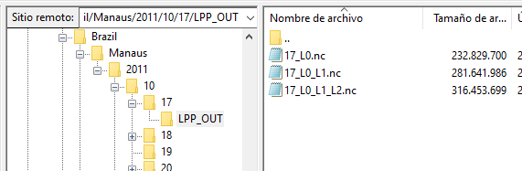

# Lidar Processing Pipeline (LPP)

The LPP is a collection of tools developed in C/C++ and Linux script, planned to handle all the steps of lidar analysis. In the present version of LPP, only elastic lidar signal are analyzed, but it is planned to manage Raman signals in the near future. 

LPP is made by 3 main tools. The first tool converts the raw data files into a single NetCDF file, including detailed information about the instrument and acquisition setup (level 0 dataset). The produced NetCDF files are then processed by another tool that applies the necessary corrections to the lidars signals and computes the cloud-mask (level 1 dataset). The final step is the elastic retrieval of aerosol properties (level 2 dataset), and for now, only elastic lidar signals are processed. The development of LPP is based on the existing analysis routines developed by individual LALINET groups, and hence takes advantage of previous efforts for algorithm comparison within the scope of the LALINET network.
The code presented in this repository was tested on Linux Ubuntu 20.04.3 LTS, and Windows 10 using WSL.

## Overall concept of the LPP tools

The Lidar Processing Pipeline (LPP) is formed by 3 completely independent software (or modules), which communicates with each other using NetCDF files. The names of each one are represented by the output of its product data level (PDL), named from 0 to 2. Each one of these modules can be executed in a Linux command line following the basic rules described in this document. These modules are:
- `lidarAnalysis_PDL0`: Transforms all the raw lidar data files stored in a folder (passed as an argument) into a single NetCDF file. This output file will contain the raw lidar signals and global information about the measurement. This output is the L0 data level of LPP.
- `lidarAnalysis_PDL1`: Receive the NetCDF file produced by `lidarAnalysis_PDL0` and produce a new NetCDF defined as data level 1 (L1). This L1 file contains the same information as the data level L0 and adds L1 information. These new data include: corrected lidar files (like laser offset, bias correction, etc.), the cloud-mask product, and molecular profiles for every wavelength used. Also, all the parameters used to produce this output are stored. This output is called L1 data level of LPP.
- `lidarAnalysis_PDL2`: Receive the NetCDF file produced by `lidarAnalysis_PDL1` and produce a new NetCDF file defined as data level 2 (L2). This L2 file contains the same data as L0 and L1 and adds the optical products obtained from the elastic lidar signals. Also, all the parameters used to produce this output are stored. This output is the L2 data level of LPP.

It is important to remark the feature that the output files produced in stages 1 and 2 contain all the information of its previous stage. The new file generated adds the new information of the stage under analysis in a NetCDF's subgroup called **L*x*_Data**, being ***x*** the data level number. This can be seen in the next figure, showing the data added in L1 stage:


Each lidar analysis tool must be run in a Linux terminal, following the convention:

<a name="run_module"></a>
```
$./lidarAnalysis_PDLx /Input_File_or_Folder/ /Output_File analysisParameters.conf
```

Where:
- `lidarAnalysis_PDLx`: Software module to generate the data level ***x***.
- `/Input_File_or_Folder/`: Input folder or file to produce the data Level ***x***. In the case of L0, this first parameter is the folder with the raw lidar data files in Licel or Raymetric data file format. For the rest of the data levels, the input is the NetCDF file produced in the previous stage.
- `/Output_File`: Output NetCDF filename. The output file contains the information of the input folder/file, adding the information of the new data of the level under analysis.
- `analysisParameters.conf`: Configuration file with all the variables needed for the level analysis.

To avoid mistakes, it is preferable to use absolute paths for all the arguments passed to the modules.

In the next sections, a step-by-step on how to install and run these modules are described.

## Installation:
Download or clone the repository from GitHub: `www.github.com/juanpallotta/LPP`. You will find:
- `/libLidar`: C/C++ lidar libraries source code.
- `/Lidar_Analysis_L0`: C/C++ sources code of `lidarAnalysis_PDL0` to produce level 0 (L0) data products.
- `/Lidar_Analysis_L1`: C/C++ sources code of `lidarAnalysis_PDL1` to produce level 1 (L1) data products.
- `/Lidar_Analysis_L2`: C/C++ sources code of `lidarAnalysis_PDL2` to produce level 2 (L2) data products.
- `/Lidar_Configuration_Files`: Contain the configuration files (`.conf`) for each module. Also, the settings file for an automatic run (see later [section](#Automatizing_LPP) about the automatization of the modules).
- `/signalsTest`: Lidar test files to test this code. You will find files from Buenos Aires, Argentina (pure Licel datatype files) and Brazil: Sao Paulo (`Brazil/SPU/` folder, Licel data type files) and Manaus ( `Brazil/Manaus` folder, Raymetric datatype files).
- `install_Lidar_Dependencies.sh`: Linux shell-script to install the basic software/libraries needed to compile and run the LPP software.
- `/compile_All.sh`: Linux shell script to compile all the modules.
- `/run_LPP_Analysis.sh`: Linux shell script to run the whole chain automatically. The main settings for automatic run are configured in its setting file (`/Lidar_Configuration_Files/LPP_Settings.sh`). More about the automatization of all modules in [Automatizing LPP](#Automatizing_LPP) section of this README file.
- `README.md`: This file.

## Using the code
## Installing dependencies:
There are a few and very basic things to be installed prior to the run of LPP. To do this job, just run the Linux shell script named `install_Lidar_Dependencies.sh`.
It is a simple Linux shell script to install the basics packages (make, g++, and NetCDF libraries). You will be asked for administrator credentials.
Remember to set `install_Lidar_Dependencies.sh` with executable attributes: `chmod +x install_Lidar_Dependencies.sh`.

## Building the code:
To compile all the modules, just run the Linux shell script named `compile_All.sh`. This is a simple Linux script that makes the executables of each module inside their folders. Remember to set `compile_All.sh` with executable attributes: `chmod +x compile_All.sh`.
At the moment, the compiler output will show some warnings. All of them will be solved in future versions.

## Configuring and running LPP modules:
The behavior of each module is based on the parameters written in its configuration file, passed as the [third argument](#run_module). In this repository, they are stored in the `/Lidar_Configuration_Files`. These are text-based files and have the variables needed for the module, having to follow only 4 main rules:
1. Comments are defined by "`#`" character. You are free to comment on anything to make the run more understandable. The configuration files included in this repository have many comments to explain each variable. Also, if a variable accepts a vector of values, all of them are commented.
2. Variables definition has to follow the convention `VAR_NAME = VALUE`, and a <u>**minimum of 1 space character has to be placed before and after the "`=`" character**</u>. The variables data type can be integer, float, double, or string.
3. Some variables have to be set as vectors. Each element must be separated by the character "`:`", for instance: `VAR_NAME = VALUE1 : VALUE2 : VALUE3` <u>**and a minimum of 1 space character has to be placed before and after the "`:`" character**</u>. The number of elements depends on the variable, and how LPP has it implemented. In order to minimize the mistakes related to this, please, read the comments in the lines before the variable definition. In case that the number of elements doesn't meet the right values, LPP will show a warning and exit the execution.
4. The configuration file could be the same for all the modules, or use one file for all of them, as far as it contains the variables needed for the run. These variables are described in the next sections.

The following sections describe each module, how to configure it, and how to run it. We highly encourage you to run the examples shown and play with its variables to feel comfortable with the uses of the modules. Then, use your own input files.

### <a name="configuring_PDL0"></a> `lidarAnalysis_PDL0`: Converting raw lidar files in a single NetCDF file
This module is used to merge the raw lidar files located in a folder (passed as first argument), into a single NetCDF file (path and filename passed as a second argument). The configuration file is passed as the third argument, and it's going to be described in this section.

An example of how to run this module using the sample signals included in this repository is shown below:

    ./lidarAnalysis_PDL0 ../signalTest/Brazil/SPU/20210730/ ../signalTest/Brazil/SPU/20210730/LPP_OUT/20210730_L0.nc ../Lidar_Configuration_Files/analysisParameters_PDL0_Brazil.conf

Where:
- `lidarAnalysis_PDL0`: Executable file of the L0 module.
- `../signalTest/Brazil/SPU/20210730/`: Input folder with the raw-lidar files in Licel or Raymetric data format. Since Licel files have no defined extension, there is no way to distinguish them from the rest of the files. Because of that, <u>**it is important that nothing but raw lidar data files must be in this input folder**</u>. 
- `../signalTest/Brazil/SPU/20210730/LPP_OUT/20210730_L0.nc`: Output path, **including the file name** of the output NetCDF file, in this example `20210730_L0.nc`. If the output file needs to be placed in a subfolder, generate it manually before running (in this example `LPP_OUT/`).
- `../Lidar_Configuration_Files/analysisParameters_PDL0_Brazil.conf`: Configuration file with the variables needed for the merging.

Be careful, if a relative path is used, it must be relative to the executable file. In this example, the executable file is `lidarAnalysis_PDL0` and is in the folder `Lidar_Analysis_L0/`.

An example of how L0 configuration file should look is seen in the next code:

```bash
#############################################################
# CONFIGURATION FILE FOR LIDAR CONVERSION TOOL 
# RAW LIDAR DATA FILES TO NETCDF FILE - DATA LEVEL 0 (L0)
#############################################################

# DATE-TIME RANGE TO ANALYZE INSIDE THE FOLDER PASSED AS ARGUMENT TO lidarAnalysis_PDL0
# IF minTime = maxTime --> ALL FILES INSIDE THE FOLDER WILL BE ANALYZED
minTime = 2021/07/30-00:00:00
maxTime = 2021/07/30-00:00:00

# INPUT DATAFILE FORMAT
inputDataFileFormat = LICEL_FILE
# inputDataFileFormat = RAYMETRIC_FILE
# inputDataFileFormat = LALINET_NETCDF -- NOT IMPLEMENTET YET
# inputDataFileFormat = SCC_NETCDF -- NOT IMPLEMENTET YET
# inputDataFileFormat = CSV -- NOT IMPLEMENTET YET

# OUTPUT NETCDF DATAFILE FORMAT --> outDataFileFormat
outputDataFileFormat = LALINET_NETCDF
# outputDataFileFormat = SCC_NETCDF
```

At the moment, configuration files for L0 data levels only need a few of basic inputs. 
* `minTime` and `maxTime`: Time bin to analyze inside the input folder. In case to analyze all the files inside the folder, these two variables have to be set equals. Pay attention to the format: `YYYY/MM/DD-HH:MM:SS`.
* `inputDataFileFormat`: At the moment, only Licel (`LICEL_FILE`) or Raymetric (`RAYMETRIC_FILE`) data type file are accepted. As can be seen, there are planned more input data types formats to convert. 
* `outputDataFileFormat`: The output data types accepted are: LALINET (`LALINET_NETCDF`) and Single Calculus Chain (`SCC_NETCDF`) data type files. 

A description of LALINET data type and its name conventions, can be seen in later sections of this document ([LALINET data type format](#LALINET_data_type_format)).

If `SCC_NETCDF` is selected, the output file generated can be used as an input for the SCC platform (https://www.earlinet.org/index.php?id=281). More info about SCC data file format and its name convention is described in the web page of the project (https://docs.scc.imaa.cnr.it/en/latest/file_formats/netcdf_file.html). It is also important to mention that if this output is selected, later modules of LPP (`lidarAnalysis_PDL1` and `lidarAnalysis_PDL2`) cannot be used.

In order to proceed without mistakes, it is highly recommended to uncomment the proper line in the configuration files included in this repository. Also, its worth mentioning that this inputs allows only one valid entry for each variable, so carefully check that only one line of each variable is uncommented.


### `lidarAnalysis_PDL1`: Producing data level 1 products: lidar signals corrections and cloud-mask

This module receives the NetCDF file produced by the previous module (`lidarAnalysis_PDL0`) as a first parameter (in our example, `../signalTest/Brazil/SPU/20210730/LPP_OUT/20210730_L0.nc`). This module will accept the input file while it is in the LALINET NetCDF format; this means, the variable `outputDataFileFormat = LALINET_NETCDF` should be set in the configuration file of L0 module.

An example of how to run this module can be:

    ./lidarAnalysis_PDL1 ../signalTest/Brazil/SPU/20210730/LPP_OUT/20210730_L0.nc ../signalTest/Brazil/SPU/20210730/LPP_OUT/20210730_L0_L1.nc ../Lidar_Configuration_Files/analysisParameters_PDL1_2_Brazil.conf

The configuration file (in this case, `../Lidar_Configuration_Files/analysisParameters_PDL1_2_Brazil.conf`) could be the same file used in module L0, or use another one. The only important thing here are the variables included in the file passed as a third argument.

The sample files included in this repository use one file for `lidarAnalysis_PDL0`, and another for modules `lidarAnalysis_PDL1` and `lidarAnalysis_PDL2`.

An example of a configuration file and its variables for L1 data-level retrieval could be:

```bash

##########################################################################################
# PARAMETERS FOR lidarAnalysis_PDL1
##########################################################################################

# LASER-BIN-OFFSET OR TRIGGER-DELAY OR ZERO-BIN
# VECTOR TYPE: ONE PER CHANNEL
# MANAUS
# indxOffset = 11 : 11 : 11 : 11 : 11 
# SAO PAULO
indxOffset = 2 : 3 : 7 : 5 : 8 : 2 : 9 : 2 : 2 : 2 : 2 : 2 

# NUMBER OF FILES (EVENTS) THAT WILL BE AVERAGED INTO A SINGLE LIDAR SIGNAL
numEventsToAvg_PDL1 = 10

# WAVELENGHT USED FOR PDL1. INDEXES STARTING FROM 0
# SP
indxWL_PDL1 = 2
# MANAUS
# indxWL_PDL1 = 0

# MOLECULAR DATA
# ABSOLUTE PATH TO THE RADIOSOUNDING/MODEL FILE. THIS FILE MUST BE FORMATTED:
# - COMMA SEPARATED
# - RANGE UNIT: METERS
# - TEMPERATURE UNIT: KELVIN
# - PRESSURE UNIT: HECTO PASCALS
Path_To_Molecular_File = ./US-StdA_DB_CEILAP.csv
# SETTINGS OF THE COLUMN INDEX (0-2) OF THE PARAMETERS RANGE-TEMPERATURE-PRESSURE IN THE FILE:
Range_column_index_in_File = 0
Temp_column_index_in_File  = 1
Pres_column_index_in_File  = 2

Temperature_at_Lidar_Station = 25.0
Pressure_at_Lidar_Station = 940.0

# INITIAL RANGE OF ANALYSIS: rInitSig
# END RANGE OF ANALYSIS: rEndSig
rInitSig = 1100
rEndSig = 25000

# NUMBER OF BINS USED FOR BACKGROUND CALCULATION (TAKEN FROM THE TAIL OF THE LIDAR SIGNAL)
nBinsBkg = 1000

# CLOUD DETECTION PARAMETERS
AVG_CLOUD_DETECTION = 101
stepScanCloud = 1
nScanMax = 5000
errFactor = 2.0
thresholdFactor = 5.0
CLOUD_MIN_THICK = 5

errScanCheckFactor = 1.0
errCloudCheckFactor = 0.0
DELTA_RANGE_LIM_BINS = 100

```

A description of each of these parameters is described below:

* `indxOffset`: The number of bins to remove from the beginning of the lidar track recorded due to the laser offset. This parameter should be a vector, with the number of elements equal to the number of channels in the file.

* `numEventsToAvg_PDL1`: Time averaging for L1 data level products. This parameters tell to `lidarAnalysis_PDL1` the numbers of lidar profiles to average and producing one merged profile. After this, the `time` dimension in the NetCDF file from the L1 data products will be reduced by `numEventsToAvg_PDL1` times.

* `indxWL_PDL1`: An index (starting from 0) of the channel to use in cloud-mask production. It is recommended to use an elastic lidar channel and the highest wavelength in the file.

* `Path_To_Molecular_File`: Path to the plain-text, comma-sepparated file containing the radiosonde/model data. This file must contain the altitude, temperature and pressure of the radiosonde/model used for the computation of the alpha and beta molecular profiles. The units of these variables are described in the comments of the setting file: altitude in m, temperature in K and pressure in hPa. This repository has a sample file of US standard model (file named `US-StdA_DB_CEILAP.csv` located in the same folder of the executable file for L1 products). In case of the radiosonde model is not in the same folder, please, write the complete path to this file. There is no necessary to write the path between inverted comas `"`.

This file must be headerless, and the column order of each parameter is described in the next variables: `Range_column_index_in_File`, `Temp_column_index_in_File` and `Pres_column_index_in_File`. As is shown in the sample code, in this case the altitude is the first column (index 0), temperature the second (index 1), and the pressure the third column (index 2). The first lines of the `US-StdA_DB_CEILAP.csv` file contained in this repository are shown in the next lines:

```
0,288.15,1013.27,0,0,1033.81,1.2247
200,286.85,989.48,0,0,1009.26,1.2013
400,285.55,966.13,0,0,985.22,1.1783
600,284.25,943.24,0,0,961.68,1.1557
800,282.95,920.78,0,0,938.62,1.1333
1000,281.65,898.77,0,0,916.05,1.1113
...
```

The data contained in columns indexes 3 to 7 are not taken into account.

* `Temperature_at_Lidar_Station`: Temperature at ground level (in Celsius).
* `Pressure_at_Lidar_Station`: Pressure at ground level (in hPa)

* `rInitSig` : Initial range of the analysis (in meters from the lidar). It is preferable to use the first point where the full overlap is achieved.
* `rEndSig `: End range of analysis (in meters).

* `nBinsBkg = 1000`: Number of bins used for background removal. 

* **Cloud-mask retrieval parameters:** These parameters are required for the cloud detection algorithm. We strongly recommend using the values set in the files included in this repository. This algorithm is robust enough to work with a wide range of lidar signals using this setup, detecting clouds and plumes under a variety of conditions.

```
AVG_CLOUD_DETECTION = 101
stepScanCloud = 1
nScanMax = 5000
errFactor = 2.0
thresholdFactor = 5.0
CLOUD_MIN_THICK = 5

errScanCheckFactor = 1.0
errCloudCheckFactor = 0.0
DELTA_RANGE_LIM_BINS = 100
```

<!-- ### `lidarAnalysis_PDL2`. Producing data level 2 products: aerosol optical parameters

    ./lidarAnalysis_PDL2 ../signalTest/Brazil/SPU/20210730/LPP_OUT/20210730__L0_L1.nc ../signalTest/Brazil/SPU/20210730/LPP_OUT/20210730_L0_L1_L2.nc ../Lidar_Configuration_Files/analysisParameters_PDL1_2_Brazil.conf -->


## <a name="Automatizing_LPP"></a>Automatizing LPP

In order to run all the LPP modules automatically, this repository contains a Linux script to do this task. The name of this script is `run_LPP_Analysis.sh`, and you can find it in the root folder of this repository. It uses a general configuration file named located in the configuration folder `Lidar_Configuration_Files/LPP_Settings.sh`.

With this script, the outputs and input paths and file names of every module are automatically generated and passed as arguments for every `lidarAnalysis_PDLx`. The rules for performing this task are explained in this section.

This automatization process uses another configuration file, named `Lidar_Configuration_Files/LPP_Settings.sh`, where the data set level and the input and output paths are set. An example of this file can be seen below:

```bash
#!/bin/bash

# DATA LEVEL TO PRODUCE IN THE RUN. 
L0="yes"
L1="yes"
L2="no"

# ABSOLUTE INPUT PATH
# PATH_IN="../signalsTest/Brazil/Manaus/2011/10/17/"
PATH_IN="../signalsTest/Brazil/SPU/20210730/"

FILE_CONF_L0="../Lidar_Configuration_Files/analysisParameters_PDL0_Brazil.conf"
FILE_CONF_L1_L2="../Lidar_Configuration_Files/analysisParameters_PDL1_2_Brazil.conf"

```

As can be seen, a few lines are needed to run the automatic mode. These are:
* `L0`, `L1` and `L2`: Data level to process. By setting `"yes"` or `"no"` at the variables `Lx`, you can control the run of each module.
* `PATH_IN/`: Main path of the raw lidar data, in wich only lidar data files (Licel or Raymetric data format) must be stored. This is the starting folder for searching raw lidar files. A folder named `LPP_OUT/` will be created automatically in the last subfolder found with raw lidar files. The `LPP_OUT` folder will be used to store the NetCDF output files produced by each LPP module.
Because there are different ways to store the data files and their folder structures, two examples will be shown and how the folder/files are generated automatically. 
* `FILE_CONF_L0` and `FILE_CONF_L0_L1`: Path to the configuration file of each module.

In order to explain how paths are generated automatically, two examples are shown. The first one is used in Sao Paulo and Argentinean lidars, where the lidar files produced in a day are stored in a single folder with the full date in its name. In the next figure, an example is shown:


It can be seen that inside a single folder you can find all the files for that day. In this situation, the script `run_LPP_Analysis.sh` will create the folder `LPP_OUT/` automatically and the output files of each modules will save the data in it. If we take a look inside the folder `/LPP_OUT` it can be seen the NetCDF files created by the modules `lidar_Analysis_PDL0` and `lidar_Analysis_PDL1`:


In the case of Manaus lidars, the structure of the folder for each measurement can be seen in the next figure:


In this case, the files are stored in a folder with the number of the day, and the data of the month and year are in a higher order folder. In this scenario, the script `run_LPP_Analysis.sh` will create the `/LPP_OUT` folder in the last subfolder, in this case, in `/17/LPP_OUT`. Inside of it, the output files of each module are found:




As can be seen, there are also rules for creating the NetCDF files name. `lidar_Analysis_PDL0` will create the L0 data level file using the name of the last subfolder with lidar files, adding `_L0.nc`. The rest of the modules, will add `_L1` and `_L2` to the input filename to produce the output filename. It can be seen in the last figure, where `lidar_Analysis_PDL0` produces `17_L0.nc` and  `lidar_Analysis_PDL1` produce `17_L0_L1.nc`. 


## <a name="LALINET_data_type_format"></a> LALINET NetCDF Data Type Format File

As was mentioned before, each LPP module has its own NetCDF file output produced by processing the information passed as the input argument (first parameter) according to the configuration file (third parameter). We describe here the status of the first version of LPP output files, but this will be upgraded as new capabilities are added.
The description of the dimensions, variables and global parameters are described in the next sections.

### NetCDF's File Produced for Data Level 0
This file contains the raw lidar data extracted from the input files, with general information contained in the header. 
<!-- As was explained in the section related to the product data level 0 ([PDL0](#configuring_PDL0)), extra information can be added to this file as global.--> 

#### Dimensions
In this version, 3 dimensions are defined:
```
time
channels
points
```
For the data level 0, the dimension `time` contains the number of lidar files located in the input folder passed as first argument to `lidarAnalysis_PDL0`.
`channels` dimension contains the number of channels contained in the lidar input files. <u>**Important Note:</u> all the lidar files stored in the input folder must have the same number of channels.** `lidarAnalysis_PDL0` considers that all the files contained in the input folder passed as first argument have the same hardware characteristics. If some changes in the hardware are made during a measurement, please, save them in another folder and analyze them in another run.
`points` dimension is the number of bins of all lidar tracks recorded.

#### Variables
The variables of the L0 are the data stored in the headers of the lidar files (in Licel/Raymetric datatype format).
The variables are listed below (in alphabetical order), with the dimensions used in parentheses:

* `Accumulated_Pulses(channels)`: Number in laser pulses accumulated in each channel.
* `ADC_Bits(channels)`: Number of bits for the ADC electronic.
* `Azimuth(time)`:
* `DAQ_Range(channels)`:
* `Laser_Source(channels)`:
* `Number_Of_Bins(channels)`:
* `PMT_Voltage(channels)`:
* `Polarization(channels)`:
* `Raw_Data_Start_Time(time)`:
* `Raw_Data_Stop_Time(time)`:
* `Raw_Lidar_Data(time, channels, points)`:
* `Wavelengths(channels)`:
* `Zenith(time)`:

**Global attributes**

* `Site_Name`: String containing the lidar's site name.
* `Altitude_meter_asl`: Double data type containing the altitude .
* `Latitude_degrees_north`: = -60.0; // double
* `Longitude_degrees_east`: = -2.9; // double
* `Range_Resolution`: = 7.5; // double
* `Laser_Frec_1`: = 10.0; // double
* `Laser_Frec_2`: = 10.0; // double

### NetCDF's File Produced for Data Level 1

### NetCDF's File Produced for Data Level 2


