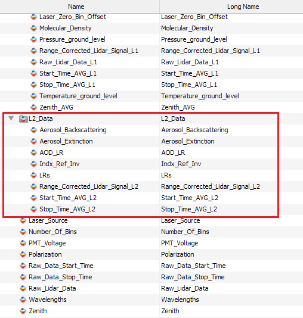

# Table of content: <!-- omit in toc -->

- [Introduction](#introduction)
- [Overall concept of the LPP tools](#overall-concept-of-the-lpp-tools)
  - [Runing a LPP module](#runing-a-lpp-module)
- [Installation](#installation)
- [Setting up the code](#setting-up-the-code)
  - [Installing dependencies](#installing-dependencies)
  - [Building the code](#building-the-code)
  - [Configuring and running LPP modules](#configuring-and-running-lpp-modules)
- [<u>Product Data Level 0 Module:</u> Converting raw lidar files in a single NetCDF file](#uproduct-data-level-0-moduleu-converting-raw-lidar-files-in-a-single-netcdf-file)
- [General Information About Lidar Data Level Products 1 and 2](#general-information-about-lidar-data-level-products-1-and-2)
- [<u>Product Data Level 1 Module:</u> Lidar signals corrections and cloud-mask](#uproduct-data-level-1-moduleu-lidar-signals-corrections-and-cloud-mask)
- [<u>Product Data Level 2 Module:</u> Aerosol optical products](#uproduct-data-level-2-moduleu-aerosol-optical-products)
- [Automatizing LPP](#automatizing-lpp)
- [LALINET NetCDF File Format](#lalinet-netcdf-file-format)
  - [NetCDF's File Produced for Data Level 0](#netcdfs-file-produced-for-data-level-0)
    - [Dimensions](#dimensions)
    - [Variables](#variables)
    - [Global attributes](#global-attributes)
  - [NetCDF's File Produced for Data Level 1](#netcdfs-file-produced-for-data-level-1)
    - [Dimensions](#dimensions-1)
    - [Variables](#variables-1)
    - [Group Attributes](#group-attributes)
  - [NetCDF's File Produced for Data Level 2](#netcdfs-file-produced-for-data-level-2)
    - [Dimensions](#dimensions-2)
    - [Variables](#variables-2)
    - [Group Attributes](#group-attributes-1)

# Introduction

The LPP is a collection of tools developed in C/C++ and Linux script, planned to handle all the steps of lidar analysis. In the present version of LPP, only elastic lidar signals are analyzed, but it is planned to manage depolarization and Raman signals in the near future.
LPP is conformed by 3 main modules: `lidarAnalysis_PDL0`, `lidarAnalysis_PDL1`, and `lidarAnalysis_PDL2`, each one producing a different data level. The first module converts the raw lidar data files into a single NetCDF file, including detailed information about the instrument and acquisition setup (product data level 0 or PDL0). The produced NetCDF files are then processed by the next module which applies the necessary corrections to the raw lidars signals and computes the cloud-mask (product data level 1 or PDL1). The final step is the elastic retrieval of aerosol parameters (product data level 2 or PDL2), and for this first release of LPP, only elastic lidar signals are processed.
The development of LPP is based on the existing analysis routines developed by individual LALINET groups, and hence takes advantage of previous efforts for algorithm comparison within the scope of the LALINET network. The code presented in this repository was tested on Linux Ubuntu 20.04.3 LTS and GCC 9.4.0.

# Overall concept of the LPP tools

The Lidar Processing Pipeline (LPP) is formed by 3 completely independent software (or modules), which communicates with each other using NetCDF files. The names of each one are represented by the output of its product data level (PDL), named from 0 to 2. Each one of these modules can be executed in a Linux command line following the basic rules described in this document. These modules are:
- `lidarAnalysis_PDL0`: Transforms all the raw lidar data files stored in a folder (passed as an argument) into a single NetCDF file. This output NetCDF file will contain the raw lidar signals and global information about the measurement. This output is the L0 data level of LPP.
- `lidarAnalysis_PDL1`: Receive the NetCDF file produced by `lidarAnalysis_PDL0` and produces a new NetCDF defined as data level 1 (L1). This L1 file contains the same information as the data level L0 and adds L1 products. These new data include corrected lidar files (like laser offset, bias correction, etc.), the cloud-mask, and molecular density profiles. Also, all the parameters used to produce this output are stored. This output is called the L1 data level of LPP.
- `lidarAnalysis_PDL2`: Receive the NetCDF file produced by `lidarAnalysis_PDL1` and produces a new NetCDF file defined as data level 2 (L2). This L2 file contains the same data as L0 and L1, adding the optical retrieval from one selected elastic channel. Also, all the parameters used to produce this output are stored. This output is the L2 data level of LPP.

It is important to remark that the output files produced in stages 1 and 2 contain all the information of its previous stage. The new file generated in each module adds the new information of the stage under analysis in a NetCDF's sub-group called **L*x*_Data**, being ***x*** the data level number. 

In the next figure, an output file is inspected with the software Panoply ([https://www.giss.nasa.gov/tools/panoply/](https://www.giss.nasa.gov/tools/panoply/)), where the data added in the stages L1 and L2 can be seen in their corresponding groups, while the L0 data is stored in the root of the NetCDF file.


The description of each variables and its dimensions are described later in this document (section [LALINET Data Type Format](#lalinet-netcdf-file-format)).

## Runing a LPP module
Each LPP's module must be run in a Linux terminal, following the convention:

<a name="run_module"></a>
```
$./lidarAnalysis_PDLx /Input_File_or_Folder/ /Output_File analysisParameters.conf [Extra_Files]
```

Where:
- `lidarAnalysis_PDLx`: Software module to generate the data level ***x***.
- `/Input_File_or_Folder/`: Input folder or file to produce the data Level ***x***. In the case of L0, this first parameter is the folder with the raw lidar data files in Licel or Raymetric data file format. For the rest of the data levels, the input is the NetCDF file produced in the previous stage.
- `/Output_File`: Output NetCDF filename. The output file contains the information of the input folder/file, adding the information of the new data of the level under analysis.
- `analysisParameters.conf`: Configuration file with all the variables needed for the level analysis.
- `[Extra_Files]`: Not mandatory information containing extra data about the lidar system, like background noise or overlap function.


To avoid possible mistakes, it is preferable to use absolute paths for all the file's arguments passed to the modules.

In the next sections, a step-by-step on how to download/clone, build and run LPP's modules are described.

# Installation
Download or clone the repository from GitHub [https://www.github.com/juanpallotta/LPP](https://www.github.com/juanpallotta/LPP). Inside you will find:

- `/libLidar`: Folder with C/C++ lidar libraries source code.
- `/Lidar_Analysis_L0`: Folder with C/C++ sources code of the module `lidarAnalysis_PDL0` for producing data level 0.
- `/Lidar_Analysis_L1`: Folder with C/C++ sources code of the module `lidarAnalysis_PDL1` for producing data level 1.
- `/Lidar_Analysis_L2`: Folder with C/C++ sources code of the module `lidarAnalysis_PDL2` for producing data level 2.
- `/Lidar_Configuration_Files`: Folder containing the configuration files (`.conf`) for each module. Also, the settings file for an automatic run (see later [section](#automatizing-lpp) about the LPP automation).
- `/signalsTest`: Lidar test files to test this code. You will find files from Buenos Aires, Argentina (Licel data type files) and Brazil: Sao Paulo (folder `Brazil/SPU/`, Licel data type files) and Manaus (folder `Brazil/Manaus`, Raymetric data type files).
- `install_Lidar_Dependencies.sh`: Linux shell-script to install the basic software/libraries needed to use LPP.
- `/compile_All.sh`: Linux shell script to compile all the modules.
- `/run_LPP_Analysis.sh`: Linux shell script to run the whole chain automatically. The main settings for automatic run are configured the setting file `/Lidar_Configuration_Files/LPP_Settings.sh`. More about the automatization of all modules in [Automatizing LPP](#automatizing-lpp) section of this README file.
- `README.md`: This file.

# Setting up the code
The first steps after downloading/cloning the LPP's source code are described in this section. After these steps, LPP will be ready to be used.

## Installing dependencies
There are a few prerequisites to be installed prior to building LPP. This job can be done by running the Linux shell script named `install_Lidar_Dependencies.sh`. It is a simple Linux shell script to install the basic packages (make, g++, and NetCDF libraries). You will be asked for administrator credentials. Remember to set `install_Lidar_Dependencies.sh` with executable attributes: `chmod +x install_Lidar_Dependencies.sh`.

## Building the code
To compile all the modules, just run the Linux shell script named `compile_All.sh`. This is a simple Linux script that produces the executables of each module inside their folders. Remember to set `compile_All.sh` with executable attributes prior run it: `chmod +x compile_All.sh`.
At the moment, the compiler output will show some warnings. All of them will be solved in future versions.

## Configuring and running LPP modules
The behavior of each module is based on the parameters written in its configuration file, passed as the [third argument](#runing-a-lpp-module). They are stored in the `/Lidar_Configuration_Files` folder of this repository. These are text-based files and have the variables needed for the module, having to follow only 4 main rules:
1. Comments are defined by "`#`" character. You are free to comment on anything to make the run more understandable for you. The configuration files included in this repository have many comments to explain each variable.
2. Variables definition has to follow the convention `VAR_NAME = VALUE`, and a <u>**minimum of 1 space character has to be placed before and after the "`=`" character**</u>. The variables data type can be integer, float, double, or string. Also, in some cases, a variable can be an array of values, in this case, a comment in the line before warning about this.
3. Some variables have to be set as vectors. Each element must be separated by the character "`:`", for instance: `VAR_NAME = VALUE1 : VALUE2 : VALUE3` <u>**and a minimum of 1 space character has to be placed before and after the "`:`" character**</u>. The number of elements depends on the variable, and how LPP has it implemented. In order to minimize the mistakes related to this, please, read the comments in the lines before the variable definition. In case that the number of elements doesn't meet the right values, LPP will show a warning and exit the execution.
4. The configuration file could be the same for all the modules, or use one file for all of them, as long as it contains the variables needed for the run. These variables are described in this document.

The following sections describe each module, how to configure it, and how to run it. We highly encourage you to run the examples shown and play with its variables to feel comfortable with the uses of the modules. Then, use your own input files.

# <u>Product Data Level 0 Module:</u> Converting raw lidar files in a single NetCDF file

This module is used to merge the raw lidar files located in a folder (passed as first argument), into a single NetCDF file (path and filename passed as a second argument). The configuration file is passed as the third argument, and it's going to be described in this section.

An example of how to run this module using the sample signals included in this repository is shown below:

    ./lidarAnalysis_PDL0 
    /mnt/Disk-1_8TB/Brazil/SPU/20210730/ 
    /mnt/Disk-1_8TB/Brazil/SPU/20210730/LPP_OUT/20210730_L0.nc 
    /home/LidarAnalysisCode/LPP/Lidar_Configuration_Files/analysisParameters_PDL0_Brazil.conf
    [Background_Noise_File]

Where:
- `lidarAnalysis_PDL0`: Executable file of the L0 module.
- `/mnt/Disk-1_8TB/Brazil/SPU/20210730/`: Absolute input folder path with the raw-lidar files in Licel or Raymetric data format. Since Licel files have no defined extension, <u>**it is critical that nothing but raw lidar data files must be in this input folder**</u>. 
- `/mnt/Disk-1_8TB/Brazil/SPU/20210730/LPP_OUT/20210730_L0.nc`: Absolute output path, <u>**including the file name**</u> of the output NetCDF file, in this example `20210730_L0.nc`. If the output file needs to be placed in a subfolder, generate it manually before running (in this example `/LPP_OUT/`).
- `/home/LidarAnalysisCode/LPP/Lidar_Configuration_Files/analysisParameters_PDL0_Brazil.conf`: Absolute path to the configuration file containing the variables needed for the merging.
- `[Background_Noise_File]`: This fourth argument is optional, and is the absolute path to the background noise file. This file is obtained by acquiring like a normal measurement with laser and Q-Switch trigger, but with fully covered telescope. If this file is provided, the data will be stored in the NetCDF file generated by this module.

It is highly recommentable to use absolute paths to avoid errors in the execution.

In this first LPP version, L0 configuration file looks like the next code:

```bash
#############################################################
# CONFIGURATION FILE FOR LIDAR CONVERSION TOOL 
# RAW LIDAR DATA FILES TO NETCDF FILE - DATA LEVEL 0 (L0)
#############################################################

# DATE-TIME RANGE TO ANALYZE INSIDE THE FOLDER PASSED AS ARGUMENT TO lidarAnalysis_PDL0
# IF minTime = maxTime --> ALL FILES INSIDE THE FOLDER
minTime = 2022/03/02-01:00:00
maxTime = 2022/03/02-02:00:00

# INPUT DATAFILE FORMAT
inputDataFileFormat = LICEL_FILE
# inputDataFileFormat = RAYMETRIC_FILE

# OUTPUT NETCDF DATAFILE FORMAT --> outDataFileFormat
outputDataFileFormat = LALINET_NETCDF
# outputDataFileFormat = SCC_NETCDF
```

L0 data levels configuration file only need a few of basic inputs:
* `inputDataFileFormat`: At the moment, only Licel (`LICEL_FILE` option) or Raymetric (`RAYMETRIC_FILE` option) data type file are accepted. There is planned to accept more input data types formats in the future. 
* `outputDataFileFormat`: The output data types accepted are: LALINET (`LALINET_NETCDF`) and Single Calculus Chain (`SCC_NETCDF`) data type files. If `SCC_NETCDF` is selected, higher modules of LPP (`lidarAnalysis_PDL1` and `lidarAnalysis_PDL2`) can not be executed due to the different names conventions of the variables inside the file. A detailed description of LALINET data type can be seen in later sections of this document ([LALINET data type format](#lalinet-netcdf-file-format)).
* `minTime` and `maxTime`: Minimum and maximum time to analyze inside the folder passed as the first argument. The format must be like the example show above: **YYYY/MM/DD-HH:MM:SS**.

If `SCC_NETCDF` is selected, the output file generated can be used as an input for the SCC platform (https://www.earlinet.org/index.php?id=281). More info about SCC data file format and its name convention is described in the web page of the project (https://docs.scc.imaa.cnr.it/en/latest/file_formats/netcdf_file.html). 

In order to proceed without making mistakes, we highly suggest to uncomment the proper line in the configuration files included in this repository. Also, its worth mentioning that this inputs allows only one valid entry for each variable, so check carefully if only one line of each variable is enabled (uncommented).

# General Information About Lidar Data Level Products 1 and 2
In the following sections, a description of the two main data level products (1 and 2) are made. Both modules uses the same configuration file passed as the third argument. The name of this file is free, but must contain the variables described in the following sections.

In the first section of this configuration file contains common information for product data levels 1 and 2. These 3 variables can be seen in next example.

```bash
##########################################################################################
# GENERAL PARAMETERS
##########################################################################################

# MAXIMUN ZENITHAL ANGLE TO ANALIZE [º] (IN CASE OF MULTIANGLE LIDARS)
maxZthAngle = 90

# NUMBER OF BINS USED FOR BACKGROUND CORRECTION (TAKEN FROM THE TAIL OF THE LIDAR SIGNAL)
nBinsBkg = 2000
# BACKGROUND CORRECTION METHOD = FIT/MEAN/FILE_BKG
BkgCorrMethod = FILE_BKG
```

Where:
- `maxZthAngle`: Maximum zenithal angle (in degrees) to be used in the analysis.
- `nBinsBkg`: Number of bins used for background correction. This quantity is taken from the tail of the lidar signal. From the exsample number in the previous line: last 2000 bins will be used.
- `BkgCorrMethod`: Background method used for the background substraction. There are 3 options:
    - `MEAN`: The bias of the lidar signal is obtained computing the mean average of the last `nBinsBkg` bins.
    - `FIT`: The bias of the lidar signal is obtained computing the linear fit of the pure molecular attenuated backscatter to the lidar signal across the last `nBinsBkg` bins.
    - `FILE_BKG`: The bias of the lidar signal is obtained using the background data. If this option is choosen, backgroun data file must be provided in the run of `lidarAnalysis_PDL0`.

This variables are used by `lidarAnalysis_PDL1` and `lidarAnalysis_PDL2`, and both modules uses the same configuration for these data.

# <u>Product Data Level 1 Module:</u> Lidar signals corrections and cloud-mask

This module receives the NetCDF file produced by the previous module (`lidarAnalysis_PDL0`) as it first parameter (in our example, `/mnt/Disk-1_8TB/Brazil/SPU/20210730/LPP_OUT/20210730_L0.nc`). This module will accept the input file while it is in the LALINET NetCDF format; this means, the variable `outputDataFileFormat = LALINET_NETCDF` should be set in the L0's module configuration file (`analysisParameters_PDL0_Brazil.conf` in this example).

An example of how to run this module can be:

    ./lidarAnalysis_PDL1 
    /mnt/Disk-1_8TB/Brazil/SPU/20210730/LPP_OUT/20210730_L0.nc 
    /mnt/Disk-1_8TB/Brazil/SPU/20210730/LPP_OUT/20210730_L0_L1.nc 
    /home/LidarAnalysisCode/LPP/Lidar_Configuration_Files/analysisParameters_PDL1_2_Brazil.conf

The configuration file (in this case, `/home/LidarAnalysisCode/LPP/Lidar_Configuration_Files/analysisParameters_PDL1_2_Brazil.conf`) could be the same file used in module L0, or use another one. The only thing that matters are the defined variables inside the file passed as a third argument.

The sample files included in this repository use one configuration file for `lidarAnalysis_PDL0`, and another for the modules `lidarAnalysis_PDL1` and `lidarAnalysis_PDL2`.

An example of the variables contained in a configuration file for L1 module is:

```bash

##########################################################################################
# PARAMETERS FOR lidarAnalysis_PDL1
##########################################################################################

# LASER-BIN-OFFSET OR TRIGGER-DELAY OR ZERO-BIN
# ARRAY: ONE PER CHANNEL
indxOffset = 2 : 3 : 7 : 5 : 8 : 2 : 9 : 2 : 2 : 2 : 2 : 2 

# NUMBER OF FILES (EVENTS) THAT WILL BE AVERAGED INTO A SINGLE LIDAR SIGNAL
numEventsToAvg_PDL1 = 10

# WAVELENGHT USED FOR PRODUCT DATA LEVEL 1 (PDL1). INDEXES STARTING FROM 0
# SP
indxWL_PDL1 = 2

# MOLECULAR DATA
# ABSOLUTE PATH TO THE RADIOSOUNDING/MODEL FILE. THIS FILE MUST BE FORMATTED:
# - COMMA SEPARATED
# - RANGE UNIT: METERS
# - TEMPERATURE UNIT: KELVIN
# - PRESSURE UNIT: HECTO PASCALS
Path_To_Molecular_File = ./US-StdA_DB_CEILAP.csv
# SETTINGS OF THE COLUMN INDEX (0-2) OF THE PARAMETERS: RANGE-TEMPERATURE-PRESSURE IN THE FILE:
Range_column_index_in_File = 0
Temp_column_index_in_File  = 1
Pres_column_index_in_File  = 2

Temperature_at_Lidar_Station = 25.0
Pressure_at_Lidar_Station = 940.0

# INITIAL RANGE OF ANALYSIS: rInitSig
# END RANGE OF ANALYSIS: rEndSig
rInitSig = 400
rEndSig = 25000

# NUMBER OF BINS USED FOR BACKGROUND CALCULATION (TAKEN FROM THE TAIL OF THE LIDAR SIGNAL)
nBinsBkg = 1000

# CLOUD-MASK RETRIEVAL PARAMETERS
avg_Points_Cloud_Mask = 101
stepScanCloud = 1
nScanMax = 5000
errFactor = 2.0
thresholdFactor = 5.0
CLOUD_MIN_THICK = 5

errScanCheckFactor = 1.0
errCloudCheckFactor = 0.0
DELTA_RANGE_LIM_BINS = 100

```

Below is a description of each of these parameters:

* `indxOffset`: The number of bins to remove from the beginning of the lidar track recorded due to the laser offset. This parameter should be an array with one element for each channel acquired.

* `numEventsToAvg_PDL1`: Time averaging for L1 data level products. This parameters tell to `lidarAnalysis_PDL1` the numbers of the adjacents lidar profiles to average producing one merged profile. After this, the `time` dimension in the NetCDF file for the L1 data products will be reduced by `numEventsToAvg_PDL1` times. The averaging is applied to the L0 lidar profiles matrix.

* `indxWL_PDL1`: An index (starting from 0) of the channel to use in cloud-mask production. It is recommended to use an elastic lidar channel and the highest wavelength in the file for better cloud discrimination.

* `Path_To_Molecular_File`: Path to the plain-text, comma-sepparated file containing the radiosonde/model data. This file must contain the altitude, temperature and pressure of the radiosonde/model used for the computation of the alpha and beta molecular profiles. The units of these variables are described in the comments of the setting file: altitude in m, temperature in K and pressure in hPa. This repository has a sample file of US standard model (file `/LPP/Lidar_Analysis_PDL1/MolData/US-StdA_DB_CEILAP.csv`). The radiosonde/model file must be headerless, and the column order of each parameter (height, temperature and pressure) are described in the following variables (`Range_column_index_in_File`, `Temp_column_index_in_File` and `Pres_column_index_in_File`).
* `Range_column_index_in_File`: Column index of the radiosonde/model file containing the range values. For this example, index 0 (first column).
* `Temp_column_index_in_File`: Column index of the radiosonde/model file containing temperature values. For this example, index 1 (second column).
* `Pres_column_index_in_File`: Column index of the radiosonde/model file containing the pressure values. For this example, index 2 (third column).
  
The first lines of the `US-StdA_DB_CEILAP.csv` file contained in this repository are shown in the next lines (data contained in columns indexes 3 to 7 are not taken into account):

```
0,288.15,1013.27,0,0,1033.81,1.2247
200,286.85,989.48,0,0,1009.26,1.2013
400,285.55,966.13,0,0,985.22,1.1783
600,284.25,943.24,0,0,961.68,1.1557
800,282.95,920.78,0,0,938.62,1.1333
1000,281.65,898.77,0,0,916.05,1.1113
...
```
* `Temperature_at_Lidar_Station`: Temperature at ground level (in Celsius).
* `Pressure_at_Lidar_Station`: Pressure at ground level (in hPa)

* `rInitSig`: Initial range of the analysis (in meters from the lidar line of sight). It is preferable to set this value to the first point where the full overlap is achieved.
* `rEndSig`: End range of analysis (in meters from the lidar line of sight). It is preferable to set this value to the last processable point in the acquired signal.

* `nBinsBkg`: Number of bins used for background removal. 

* **Cloud-mask retrieval parameters:** These parameters are required for the cloud detection algorithm. We strongly recommend using the values set in the files included in this repository. The algorithm used is robust enough to work with a wide range of elastic-lidar signals using this setup.

```
avg_Points_Cloud_Mask = 101
stepScanCloud = 1
nScanMax = 5000
errFactor = 2.0
thresholdFactor = 5.0
CLOUD_MIN_THICK = 5

```

# <u>Product Data Level 2 Module:</u> Aerosol optical products
This module receives the NetCDF file produced by the previous module (`lidarAnalysis_PDL1`) as a first parameter (in our example, `/mnt/Disk-1_8TB/Brazil/SPU/20210730/LPP_OUT/20210730_L0_L1.nc`). This module will accept the input file while it is in the LALINET NetCDF format; this means, the variable `outputDataFileFormat = LALINET_NETCDF` should be set in the configuration file of L0 module.

An example of how to run this module can be:

    ./lidarAnalysis_PDL2
    /mnt/Disk-1_8TB/Brazil/SPU/20210730/LPP_OUT/20210730_L0_L1.n
    /mnt/Disk-1_8TB/Brazil/SPU/20210730/LPP_OUT/20210730_L0_L1_L2.nc 
    /home/LidarAnalysisCode/LPP/Lidar_Configuration_Files/analysisParameters_PDL1_2_Brazil.conf

The configuration file (in this case, `/home/LidarAnalysisCode/LPP/Lidar_Configuration_Files/analysisParameters_PDL1_2_Brazil.conf`) is the same file used in module L1 and also contains the variables needed for the optical products retrieval (L2).

An example of a configuration file and its variables for L2 data-level retrieval could be:

```bash

##########################################################################################
# PARAMETERS FOR lidarAnalysis_PDL2
##########################################################################################

# NUMBER OF FILES (EVENTS) THAT WILL BE MERGED (AVERAGED) INTO A SINGLE LIDAR SIGNAL
# IF NEGATIVE, ALL THE L0 PRIFILES WILL BE AVERAGED
numEventsToAvg_PDL2 = 18

# NUMBER OF POINTS USED FOR A SMOOTHING SLIDING WINDOWS TO APPLY TO THE RCLS BEFORE FERNALD'S INVERSION
avg_Points_Fernald = 51

# FERNALD INVERSION PARAMETER
# LR: COULD BE AN ARRAY OR A SINGLE VALUE
LR = 50 : 60 : 70 : 80
# INDEX OF THE CHANNEL TO BE INVERTED (INDEXED FROM 0)
indxWL_PDL2 = 0

# REFERENCE HEIGHT FOR LIDAR SIGNAL (ABOVE SEA LEVEL)
heightRef_Inversion_ASL = 10000
# HALF NUMBER OF POINTS (BINS) TO AVERAGE AROUND THE REFERENCE HEIGHT DURING THE NORMALIZATION OF THE LIDAR SIGNAL.
avg_Half_Points_Fernald_Ref = 15
# BACKSCATTERING RATIO = R_ref = BetaTot(rRef) / BetaMol(rRef) >1
R_ref = 1
```

A description of each of these parameters is described below:

* `numEventsToAvg_PDL2`: Time averaging for L2 data level products. This parameters tell to `lidarAnalysis_PDL2` the numbers of the adjacents lidar profiles to average and produce one merged profile. After this, the `time` dimension in the NetCDF file for the L2 data products will be reduced by `numEventsToAvg_PDL2` times. The averaging is applied to the L0 lidar profiles matrix. If this parameter is negative, all L0 profiles will be averaged producing only one profile to invert.
* `avg_Points_Fernald`: Numbers of points used in the spatial smoothing of the signal.
* `LR`: Lidar ratio used for the inversion. It can be more than one value, in wich each elements must be sepparated by `:`, with a space before and after `:` (see the example array in the previous lines: `LR = 50 : 60 : 70 : 80`).
* `indxWL_PDL2`: Index of the channel used for the inversion (starting at 0). This first version, only one channel can be accepted for the inversion, and the aerosol optical output will have dimensions of `time`, `LR` and `points`.
* `heightRef_Inversion_ASL`: Altitude above sea level (in meters) used as reference height used to normalize the lidar signal.
* `avg_Half_Points_Fernald_Ref`: Number of bins used to obtain the mean value of the lidar signal around `heightRef_Inversion_ASL` altitude. The average is performed from `heightRef_Inversion_ASL - avg_Half_Points_Fernald_Ref` to `heightRef_Inversion_ASL + avg_Half_Points_Fernald_Ref`.
* `R_ref`: Backscatter ratio at reference altitude, being the ratio for the total to the molecular backscatter. This parameter can control the turbidity of the reference altitude, being `R_ref=1` completely molecular, and higher values mean more polluted reference altitude.


# Automatizing LPP

In order to run all the LPP modules automatically, this repository contains a Linux script to do this task. The name of this script is `run_LPP_Analysis.sh`, and you can find it in the root folder of this repository. It uses a general configuration file located in the configuration folder `/LPP/Lidar_Configuration_Files/LPP_Settings.sh` and contain the basics instructions for the automatic run.

Using `run_LPP_Analysis.sh`, all the outputs and input paths and files names needed as argument for every module are automatically generated. In this section, the rules used for automatic folder and filename generation are explained.

In the configuration file (`/LPP/Lidar_Configuration_Files/LPP_Settings.sh`), the outputs data set levels and the input and output paths are set. An example of this file can be seen below:

```bash
# DATA LEVEL TO PRODUCE IN THE RUN. 
L0="yes"
L1="yes"
L2="yes"

# ABSOLUTE INPUT PATH
PATH_IN="/mnt/Disk-1_8TB/Brazil/SPU/20210730/"

# NOISE FILE OBTAINED WITH THE TELESCOPE COVERED AND THE LASER FIRING.
# ! IF THERE IS NO NOISE FILE: THE FILENAME MUST BE SET AS: "-"
# ! IF THERE IS    NOISE FILE: THE FILENAME MUST CONTAIN THE STRING 'bkg' IN SOME PART OF ITS NAME!!!
# PATH_FILE_NOISE="-"
PATH_FILE_NOISE="/mnt/Disk-1_8TB/Argentina/SPU/20210730/bkg_20210730"

FILE_CONF_L0="/home/LidarAnalysisCode/LPP/Lidar_Configuration_Files/analysisParameters_PDL0_Brazil.conf"
FILE_CONF_L1_L2="/home/LidarAnalysisCode/LPP/Lidar_Configuration_Files/analysisParameters_PDL1_2_Brazil.conf"

```

As can be seen, a few variables are needed to run LPP automatically. These are:
* `L0`, `L1` and `L2`: Data level to process. By setting `"yes"` or `"no"` at these variables, the control of the run of each module can be controled.
* `PATH_IN`: Path of the raw lidar data, in wich only lidar data files (Licel or Raymetric data file format) must be stored. Subfolders containing lidar data files will be also analyzed. A folder named `/LPP_OUT/` will be created automatically in the last subfolder found with raw lidar files. The `/LPP_OUT/` folder will be used to store the NetCDF output files produced by each LPP module.
Because there are different ways to store the data files and their folder structures, two examples will be shown and how the folder/files are generated automatically. 
* `PATH_FILE_NOISE`: Absolute path to the background file, which must contain the string `bkg` in some part of its name. This information is not mandatory, and if is not used, must be defined as `"-"`. This variable is passed as fourth argument to `lidarAnalysis_PDL0`.
* `FILE_CONF_L0` and `FILE_CONF_L0_L1`: Absolute path to the configuration file of each module.

In order to explain how paths are generated automatically, two typical examples are shown. The first one is used in Sao Paulo and Argentinean lidars, where the lidar files produced in a day are stored in a single folder with the full date in its name, as can be seen in the next figure:


It can be seen that inside a single folder you can find all the files for that day. In this situation, the script `run_LPP_Analysis.sh` will create the folder `/LPP_OUT/` automatically and the output files of each modules will save them in it. If we take a look inside the folder `/LPP_OUT/` it can be seen the NetCDF files created by the modules `lidar_Analysis_PDL0`, `lidar_Analysis_PDL1` and `lidar_Analysis_PDL2`:


For this example the results are going to be the same if we set `PATH_IN="/mnt/Disk-1_8TB/Brazil/SPU/20210730/"` or `PATH_IN="/mnt/Disk-1_8TB/Brazil/SPU/"`, since there is no more folders with data inside `../SPU/` than `/SPU/20210730/`.

In the case of Manaus lidars, the structure of the folder for each measurement can be seen in the next figure:


In this case, the files are stored in a folder with the number of the day, and the data of the month and year are in a higher order folder. In this scenario, the script `run_LPP_Analysis.sh` will create the `/LPP_OUT` folder in each subfolders corresponding of the day (i.e., `/17/LPP_OUT`, `/18/LPP_OUT`, etc). Inside of it, the output files of each module are stored:


<!--- <p align = "center">
Automatic generated output folder /LPP/ with its files.
</p> --->

So, in case that only one day is needed to be analyzed, the input path should be set as `PATH_IN="/mnt/Disk-1_8TB/Brazil/Manaus/2011/10/17/"`, and if a whole month is needed to be analyzed: `PATH_IN="/mnt/Disk-1_8TB/Brazil/Manaus/2011/10/"`. In this later option, inside each folder corresponding to the days the folder `/LPP/` will be generated.

As can be seen in last Figures, there are also rules for creating the NetCDF files name. `lidar_Analysis_PDL0` will create the L0 data level file using the name of the last subfolder with lidar files, adding `_L0.nc` at the end of its name. The rest of the modules works in the same way adding `_L1` and `_L2` to the input filename of each module, producing the output filename. It can be seen in the last figure the output files of each module, where `lidar_Analysis_PDL0` produces `17_L0.nc`, `lidar_Analysis_PDL1` produces `17_L0_L1.nc`, and `lidar_Analysis_PDL2` produces `17_L0_L1_L2.nc`. 

As was mentioned before, `17_L0_L1.nc` contains the information of `17_L0.nc`, and `17_L0_L1_L2.nc`, contains the information of `17_L0_L1.nc`.


# LALINET NetCDF File Format

This section describes in detail the NetCDF's dimensions and variables and saved by each LPP's module.

## NetCDF's File Produced for Data Level 0
This file contains the raw lidar data extracted from the raw lidar files. General information stored in the header files are also saved. 

### Dimensions
In this version, 3 dimensions are defined:
```
time
channels
points
```
The length of the `time` dimension is equal to the number of raw lidar signals stored in the variable `Raw_Lidar_Data`. The lenght of this dimmensions is not necessarily the same of the number of files of the input folder (variable name `PATH_IN` in `LPP_Settings.sh` or the first argument passed to `lidarAnalysis_PDL0`). This is because it is possible to set the time range of analysis in the configuration file of this module (variables `minTime`, `maxTime`).


`channels` store the number of channels saved in the file. The length of this dimension is the number of channels contained in the raw lidar files inputs. <u>**Important Note:</u> all the lidar files stored in the input folder must have the same number of channels.** `lidarAnalysis_PDL0` considers that all the files contained in the input folder passed as first argument have the same hardware features. If some changes in the hardware are made during a measurement, please, save them in another folder and analyze them in another run.

`points` dimension store the bins of the lidar tracks recorded.


### Variables
The variables of the data level 0 are not only the raw lidar signals, but also the data stored in the headers. In next figure, a list of the variables inspected with Panoply software is shown:


Following, a brief description of the variables (in alphabetical order), is done. The dimensions of each one are shown between parentheses

* `Accumulated_Pulses (channels)`: Number of laser pulses accumulated in for channel.
* `ADC_Bits (channels)`: Number of electronic ADC's bits.
* `Azimuth (time)`: Array with azimuth angle of each saved profile (in degrees).
* `DAQ_Range (channels)`: Maximun DAQ range set in the Licel, in mV.
* `Laser_Source (channels)`: Number of laser source set for each channel.
* `Number_Of_Bins (channels)`: Number of bins saved for each channel.
* `PMT_Voltage (channels)`: Photomuliplier voltage used in each channel.
* `Polarization (channels)`: Polarization of each channel. Terminology used in the Licel/Raymetric files: `o: no polarisation`, `s: perpendicular`, `l: parallel`.
* `Raw_Data_Start_Time (time)`: GPS start time of each lidar profile.
* `Raw_Data_Stop_Time (time)`: GPS stop time of each lidar profile.
* `Raw_Lidar_Data (time, channels, points)`: Raw lidar data, as it is read from the file, whitout any correction.
* `Wavelengths (channels)`: Array with the wavelenghts recorded in the file (in nanometers).
* `Zenith (time)`: Array with the zenithal angle of each saved profile (in degrees). 

### Global attributes
Here, global variables taken from the headers of the raw lidar files. All these data are dimensionless, being single values of any type.

* `Site_Name`: String containing the lidar's site name.
* `Altitude_meter_asl`: Altitude of the lidar site, in meters and above sea level.
* `Latitude_degrees_north`: Double data type with the latitude of the lidar site.
* `Longitude_degrees_east`: Double data type with the longitude of the lidar site.
* `Range_Resolution`: Double data type with the range resolution (in meters).
* `Laser_Frec_1`: Double data type with the laser 1 repetition rate (in Hz). 
* `Laser_Frec_2`: Double data type with the laser 2 repetition rate (in Hz).

## NetCDF's File Produced for Data Level 1

All the variables generated in module `lidarAnalysis_PDL1` are stored in a sub-group called `L1_Data`, and the information from data level 0 is mantained in the root structure of the NetCDF file.

### Dimensions

The dimensions name of this sub-group are inherited from L0 data.

```
time
channels
points
```
Due to time averaging, `time` dimension from data L1 could be different to `time` dimension from data L0. `channels` and `points` dimensions are equal to data L0. 

### Variables
In the next figure, a glimpse of the `L1_Data` are shown using Panoply software.


Following, a brief description of the variables (in alphabetical order), is done. The dimensions of each one are shown between parentheses.

* `Azimuth (time)`: Array with azimuth angle of each saved profile (in degrees).
* `Cloud_Mask (time, points)`: Matrix with the cloud mask of the measurement. Each point is flagged as cloud free ('0' value) or cloud contaminated ('1' value).
* `Laser_Zero_Bin_Offset (channels)`: Number of points removed from each channel due to the laser offset.
* `Molecular_Density (points)`: Molecular density profile to be used in the inversion module.
* `Pressure_Ground_Level (time)`: Atmospheric pressure at site level (to be used in future versions of LPP).
* `Range_Corrected_Lidar_Signal_L1 (time, channels, points)`:  Range corrected lidar signals. These signals has all the corrections as the time and spatial averaging set for this data level in the corresponding confiugation file passed as third argument.
* `Raw_Lidar_Data_L1 (time, channels, points)`: Raw lidar data used in level 1. These signals has the all the corrections as the time and spatial averaging.
* `Start_Time_L1 (time)`: GPS start time of each averaged lidar profile.
* `Stop_Time_L1 (time)`: GPS stop time of each averaged lidar profile.
* `Temperature_Ground_Level (time)`:  Atmospheric temperature at site level (to be used in future versions of LPP)..
* `Zenith (time)`: Array with zenith angle of each saved profile (in degrees).


### Group Attributes
Here, the essentials constants needed for the correction of the lidar signals and cloud mask processing are stored.

* `indxChannel_for_Cloud_Mask`: Index number (started from 0) of the channel used to process the cloud mask.
* `avg_Points_Cloud_Mask`: Number of points used for spatial smoothing to te lidar signal before to apply the cloud masking.
* `num_Points_Bkg`: Numbers of points used to compute the bias of the raw lidar signal. This value is the same as `nBinsBkg` set in the configuration file passed as argument to `lidarAnalysis_PDL1`.

## NetCDF's File Produced for Data Level 2

`lidarAnalysis_PDL2` module produces a copy of the NetCDF file made for `lidarAnalysis_PDL1`, adding the results of this data level in the sub-group called `L2_Data`.

### Dimensions
This module adds a new dimension related to the lidar ratios used in the inversion. The dimensions in this sub-group are:
```
time
channels
points
lrs
```

As in `L1_Data` sub-group, `time` dimension is averaged using data from level 0, so it could be different from `time` dimension from the data level 1.
The current version of `lidarAnalysis_PDL2` only accept the inversion of only one wavelength per run. The channel selected for the inversion is set in the variable `indxWL_PDL2` in the configuration file passed as third argument to this module. In this sense, the lidar ratio dimension is added for aerosols optical profiles, where has the dimensions (`time`, `lrs`, `points`).

### Variables
The `L2_Data` sub-group data variables can be observed in the next Figure.



The variables (in alphabetical order) are described below. The dimensions of each one are shown between parentheses.

* `Aerosol_Backscattering (time, lrs, points)`: Aerosol backscattering profiles of the channel selected for the inversion. One profile per time and lidar ratio, both set in the configuration file passed as third argument to the `lidarAnalysis_PDL2` module.
* `Aerosol_Extinction (time, lrs, points)`: Aerosol extinction profiles of the channel selected for the inversion. One profile per time and lidar ratio, both set in the configuration file passed as third argument to the `lidarAnalysis_PDL2` module.
* `AOD_LR (time, lrs)`: Aerosols optical depth obtained by integrating the aerosol extinction profile across the `point` dimmension.
* `LRs (lrx)`: Lidar ratios used in the inversion. The values are set in the configuration file as the variable `LR`.
* `Range_Corrected_Lidar_Signal_L2 (time, channels, points)`: Range corrected lidar signals. These signals has all the corrections, as the time and spatial averaging set for this data level in the corresponding confiugation file passed as third argument.
* `Start_Time_L2 (time)`: GPS start time of each averaged lidar profile.
* `Stop_Time_L2 (time)`: GPS stop time of each averaged lidar profile.

### Group Attributes

The essentials constants needed for applying the Fernald inversion are stored.

* `indxChannel_for_Fernald_inv`: Index number (started from 0) of the channel used to process Fernald inversion. This value is taken from the configuration file passed as third argument to `lidarAnalysis_PDL2` in the variable `indxWL_PDL2`.
* `Wavelength_Inverted`: Wavelength inverted in nanometers.
* `Indx_Ref_Inv`: Index (started from 0) of the point used as reference in the Fernald inversion. It must be located in a purest molecular range.
* `R_ref`: Backscatter ratio at reference altitude (or index `Indx_Ref_Inv`) used in the inversion. This value is taken from the configuration file passed as third argument to this module in the variable `R_ref`.
